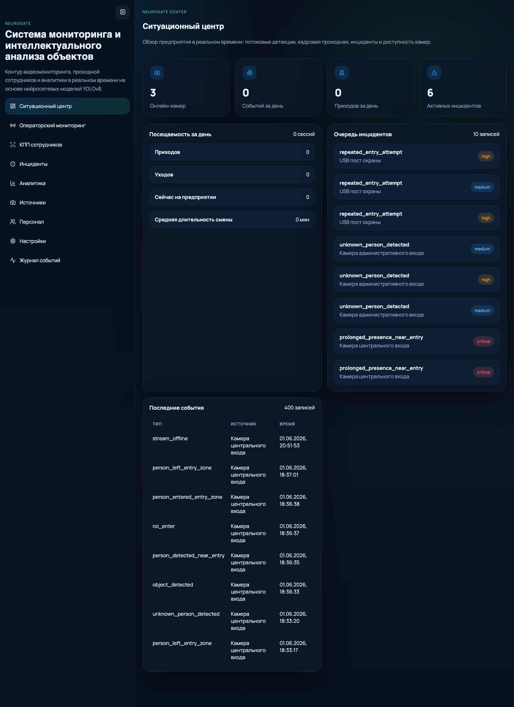
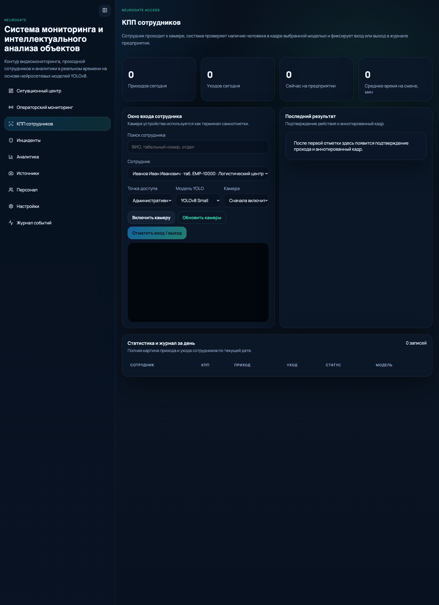
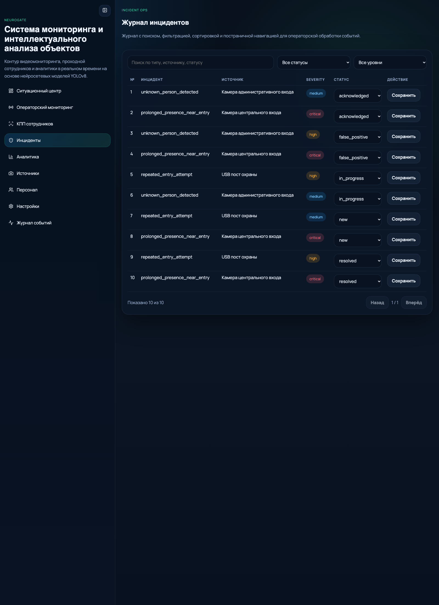
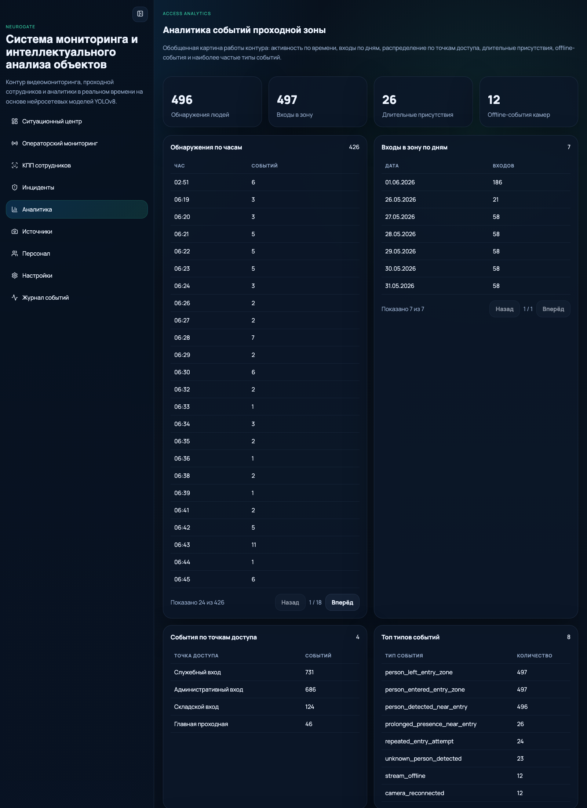
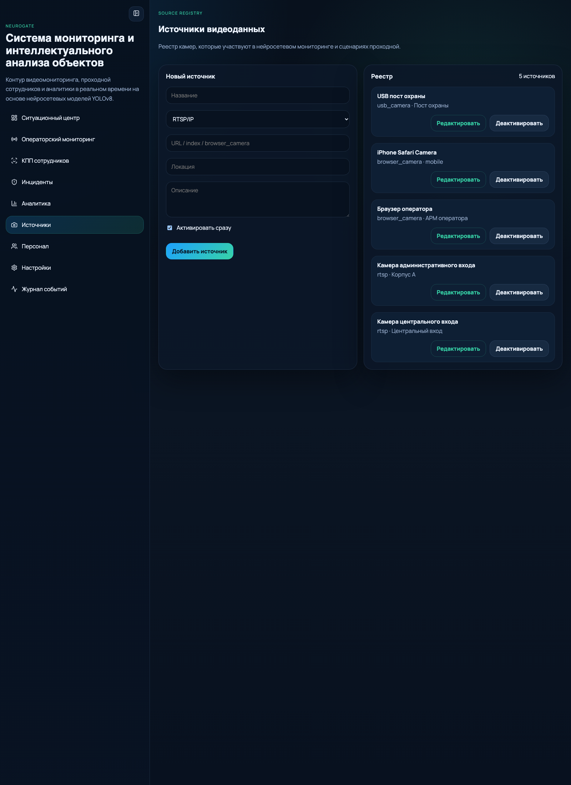
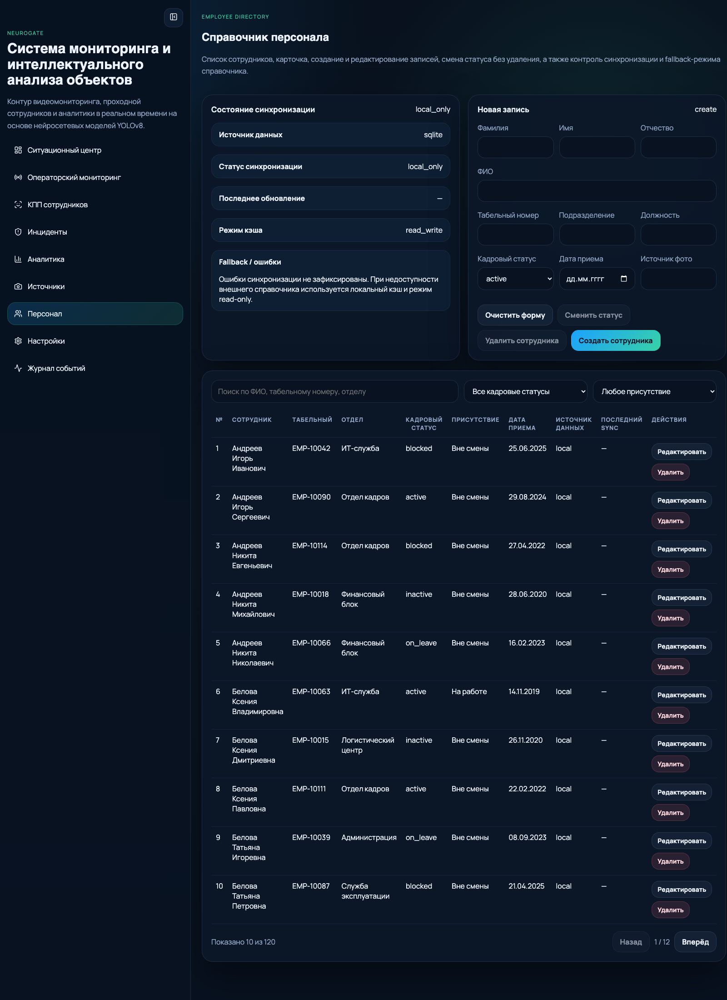

# NeuroGate

Интеллектуальная система видеомониторинга проходной и контроля событий доступа для предприятия.

`FastAPI` отдает API и production UI, `React` закрывает операторские и административные сценарии, `YOLOv8` отвечает за детекцию и трекинг людей, `worker` обрабатывает видеопотоки в фоне без постоянно открытого браузера.


## Обзор

NeuroGate предназначен для мониторинга входной зоны предприятия, регистрации событий проходной, контроля доступности камер и работы со справочником сотрудников. Система собирает события из видеопотока, формирует прикладные инциденты и предоставляет единый интерфейс для оператора, службы безопасности и администратора.

Основные сценарии:

- ситуационный центр с KPI, очередью инцидентов и последними событиями;
- операторский мониторинг камер и анализ кадров;
- проходная сотрудников с фиксацией check-in/check-out;
- журнал событий и связывание событий с сотрудниками;
- аналитика по точкам доступа, типам событий и offline-камерам;
- управление источниками видеоданных и runtime-настройками.

## Скриншоты ключевых экранов

> Ниже показаны основные страницы production UI.

| Ситуационный центр | КПП сотрудников |
| --- | --- |
|  |  |

| Инциденты | Аналитика |
| --- | --- |
|  |  |

| Источники видеоданных | Справочник сотрудников |
| --- | --- |
|  |  |

## Что умеет система

- обрабатывать `RTSP/IP`, `USB`, `HLS/HTTP` и browser-camera источники;
- выполнять детекцию и трекинг людей на базе `YOLOv8`;
- интерпретировать ROI как входную зону и строить события домена;
- вести журнал событий, инцидентов и аудит действий оператора;
- регистрировать посещаемость сотрудников через экран проходной;
- работать с локальным или внешним employee directory;
- отдавать единый web UI прямо из backend-сервиса.

## Предметные события

Система уже формирует и сохраняет, в том числе:

- `person_detected_near_entry`
- `person_entered_entry_zone`
- `person_left_entry_zone`
- `prolonged_presence_near_entry`
- `unknown_person_detected`
- `repeated_entry_attempt`
- `stream_offline`
- `camera_reconnected`

Сырые detection-события и предметные события проходной разделены на уровне модели данных, поэтому контур можно дальше развивать в сторону СКУД, идентификации и интеграции с внешними системами без переделки базовой архитектуры.

## Архитектура

```text
React UI -> FastAPI -> services/analytics/db
                     -> SQLite
worker/video -> core/services -> events/incidents/frames
```

Ключевые модули:

- `api/` - backend API и раздача production frontend;
- `frontend/` - React/Vite интерфейс;
- `video/` - ingest и фоновые циклы обработки источников;
- `core/` - inference, tracking, ROI logic;
- `services/` - доменные сервисы, telemetry, incidents, attendance;
- `db/` - доступ к `SQLite`;
- `analytics/` - агрегаты для dashboard и аналитики;
- `ui/` + `app.py` - legacy Streamlit-контур, сохраненный для демонстрационных и исследовательских сценариев.

## Технологический стек

| Слой | Технологии |
| --- | --- |
| Backend | `FastAPI`, `uvicorn`, `pydantic` |
| Frontend | `React`, `TypeScript`, `Vite`, `TanStack Query` |
| Vision | `YOLOv8`, tracking, ROI/event rules |
| Storage | `SQLite` |
| Runtime | отдельный `worker`, snapshots, audit log, telemetry |

## Быстрый старт

### 1. Подготовить Python-окружение

```bash
python3 -m venv .venv
source .venv/bin/activate
pip install -r requirements.txt
pip install -r requirements-api.txt
```

### 2. Собрать production UI

```bash
cd frontend
npm install
npm run build
cd ..
```

### 3. Запустить API и UI

```bash
./.venv/bin/python run_api.py
```

После запуска интерфейс будет доступен по адресу:

```text
http://127.0.0.1:8000
```

### 4. Запустить фонового worker

В отдельном терминале:

```bash
source .venv/bin/activate
python run_worker.py
```

Одноразовый проверочный цикл:

```bash
python run_worker.py --once
```

## Режимы запуска

### Production path

1. `worker` читает активные серверные источники.
2. Выполняет детекцию и трекинг людей.
3. Формирует события и обновляет `worker_status`.
4. Сохраняет snapshots и runtime-состояние.
5. `FastAPI` отдает UI, API, телеметрию и агрегаты.

### Frontend dev mode

Если нужен отдельный dev-сервер фронтенда:

```bash
cd frontend
npm run dev
```

По умолчанию Vite работает на:

```text
http://127.0.0.1:5173
```

### Legacy Streamlit

Исторический Streamlit-контур сохранен в репозитории и может использоваться для локальной отладки, демонстрации или материалов ВКР:

```bash
streamlit run app.py
```

## Ключевые API endpoints

| Endpoint | Назначение |
| --- | --- |
| `/api/v1/dashboard/summary` | агрегаты для ситуационного центра |
| `/api/v1/events` | журнал событий |
| `/api/v1/incidents` | очередь инцидентов |
| `/api/v1/video-sources` | управление источниками |
| `/api/v1/employees` | справочник сотрудников |
| `/api/v1/attendance/today` | посещаемость за день |
| `/api/v1/system/settings` | runtime-настройки |
| `/health`, `/metrics` | healthcheck и telemetry |

## Важные переменные окружения

| Переменная | Назначение |
| --- | --- |
| `MONITORING_DB_PATH` | путь к SQLite базе |
| `EMPLOYEE_DB_MODE` | режим employee directory: `sqlite`, `api`, `supabase`, `postgres`, `mysql` |
| `EMPLOYEE_API_URL` | URL внешнего employee API |
| `EMPLOYEE_API_TOKEN` | токен внешнего employee API |
| `SUPABASE_URL` | URL проекта Supabase |
| `SUPABASE_KEY` | ключ Supabase |

Пример:

```bash
export MONITORING_DB_PATH=/opt/neurogate/data/monitoring.db
export EMPLOYEE_DB_MODE=api
export EMPLOYEE_API_URL=https://example.company/api/employees
export EMPLOYEE_API_TOKEN=secret-token
```

## Структура репозитория

```text
api/
analytics/
config/
core/
db/
docs/
frontend/
models/
scripts/
services/
tests/
ui/
video/
app.py
run_api.py
run_worker.py
```

## Дополнительно

- `scripts/reset_seed_database.py` - пересоздание демонстрационных данных;
- `scripts/start_api.sh` - entrypoint для контейнерного запуска;
- `docker-compose.yml` и `Dockerfile` - заготовки для server deployment.
