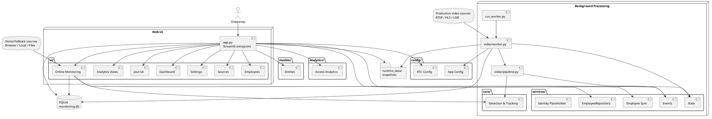
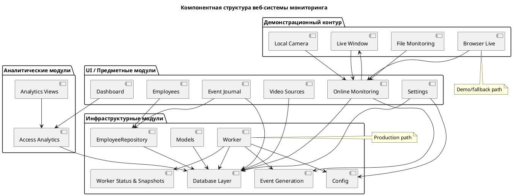
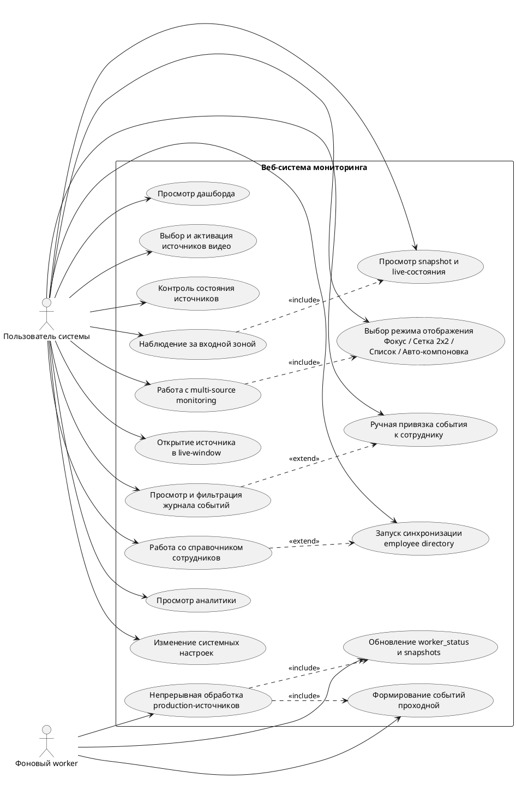

# 2. Проектирование системы мониторинга и интеллектуального анализа

После анализа предметной области и формулирования требований необходимо определить архитектурные решения, обеспечивающие практическую реализацию системы. В данной главе рассматриваются общая архитектура приложения, его модульная структура, эксплуатационные режимы и ключевые пользовательские сценарии.

## 2.1. Разработка общей архитектуры системы

Фактическая архитектура проекта представляет собой многослойную Python-систему, в которой разделены пользовательский контур, фоновая обработка видеопотоков, сервисная логика, хранение данных и аналитические представления. Точкой входа интерфейса является `app.py`, а точкой входа фоновой обработки — `run_worker.py`.

Такое разделение принципиально: если бы интерфейс был владельцем production-видеопотока, обработка зависела бы от пользовательской сессии. Выделенный worker устраняет эту зависимость: он читает активные источники из базы, получает кадры, формирует события, сохраняет snapshots и обновляет `worker_status`, тогда как интерфейс работает с уже накопленными данными.

Слой компьютерного зрения распределен между каталогами `core/` и `video/`. В `core/` сосредоточены загрузка модели, работа с ROI и интерактивные сценарии, в `video/` — production-контур, включающий worker, pipeline и snapshots. `services/` отвечает за прикладную интерпретацию результатов обработки, `db/` — за хранение данных в `SQLite`, `analytics/` — за агрегированные представления, `config/` — за системные параметры, а `models/` — за базовые описания сущностей.

Поток данных имеет однозначное направление: источник передает кадры в worker или foreground-контур, далее выполняются детекция, трекинг и проверка ROI, после чего события, состояния worker и snapshots сохраняются в базе и runtime-каталоге, а интерфейс считывает эти данные и отображает пользователю. В архитектуре различаются `production path` и `demo/fallback path`, что позволяет совместить устойчивость и демонстрационную гибкость.

Рисунок 2.1 – Архитектурная схема веб-системы мониторинга и интеллектуального анализа объектов в реальном времени

Диаграмма отражает разделение системы на интерфейсный, фоновый, сервисный и аналитический контуры. В ней показано, что production-обработка выполняется отдельным worker-процессом, тогда как Streamlit-интерфейс работает с уже накопленными данными и состояниями.

## 2.2. Проектирование модульной структуры приложения

Модульная структура проекта отражает реальные пользовательские и технологические контуры. К предметным модулям относятся dashboard, online monitoring, employees, event journal и video sources. К аналитическим — `analytics/access.py` и интерфейсные представления аналитики.

Инфраструктурную основу образуют worker, event generation, `EmployeeRepository`, database layer, механизмы `worker_status` и snapshots, конфигурационный слой и модели данных. Отдельную группу составляют демонстрационные компоненты: browser live, local camera, file monitoring и `live-window`.

Такая декомпозиция отделяет предметные модули от вычислительного и эксплуатационного контура и сохраняет прозрачность архитектуры.

Рисунок 2.2 – Компонентная структура веб-системы мониторинга и интеллектуального анализа объектов

На диаграмме показана декомпозиция приложения на предметные, аналитические, инфраструктурные и демонстрационные модули. Такая структура соответствует реальному разбиению проекта по каталогам и ролям компонентов.

## 2.3. Эксплуатационные режимы и технологические контуры системы

В текущем проекте корректнее говорить не о формализованной корпоративной ролевой модели, а об эксплуатационных режимах. Первый из них — операторский режим наблюдения, охватывающий dashboard, online monitoring, журнал событий и аналитику.

Второй режим связан с конфигурацией и источниками: пользователь добавляет и редактирует video sources, управляет их активностью и изменяет параметры обработки. Третий режим относится к справочнику сотрудников и статусу синхронизации employee directory.

Отдельно существует автоматизированный технологический контур — фоновый worker. Он не является пользовательской ролью, но выполняет постоянную production-обработку активных источников, формирует события и поддерживает `worker_status`. Интерфейс отвечает за представление и управление, worker — за непрерывную обработку, конфигурационный слой — за согласованность параметров.

## 2.4. Проектирование пользовательских сценариев и интерфейса

Пользовательские сценарии системы выстроены вокруг типового цикла работы оператора. Начальной точкой служит дашборд, после которого пользователь переходит к monitoring, журналу, аналитике, разделу сотрудников, источникам видео или настройкам.

Сценарий управления источниками обеспечивает добавление, редактирование, тестирование и активацию video sources. Сопровождение worker реализовано через просмотр `worker_status`, времени последнего кадра, heartbeat, ошибок и snapshots.

Центральным прикладным сценарием остается наблюдение за входной зоной. В online monitoring доступны production-источники, snapshots и interactive-сценарии. Интерфейс поддерживает multi-source monitoring с режимами «Фокус», «Сетка 2x2», «Список» и «Авто-компоновка», а `live-window` позволяет вынести выбранный источник в отдельное окно.

Отдельные сценарии связаны с журналом событий, аналитикой и справочником сотрудников. Журнал поддерживает фильтрацию, карточку события, ручную привязку к сотруднику и экспорт выборки. Аналитический раздел предоставляет агрегаты по времени, типам событий, точкам доступа и состоянию источников. Раздел сотрудников поддерживает локальный и удаленный режимы работы со справочником.

Интерфейс также должен честно различать `production monitoring` и `demo/fallback` режимы. Первое опирается на server-side обработку worker, второе — на browser live, локальную камеру и файловые сценарии в пределах пользовательской сессии.

Рисунок 2.3 – Диаграмма вариантов использования веб-системы мониторинга и интеллектуального анализа объектов

Диаграмма фиксирует основные действия пользователя и автономные функции фонового worker. Она показывает, какие сценарии доступны через интерфейс и какие процессы система выполняет без участия оператора.

