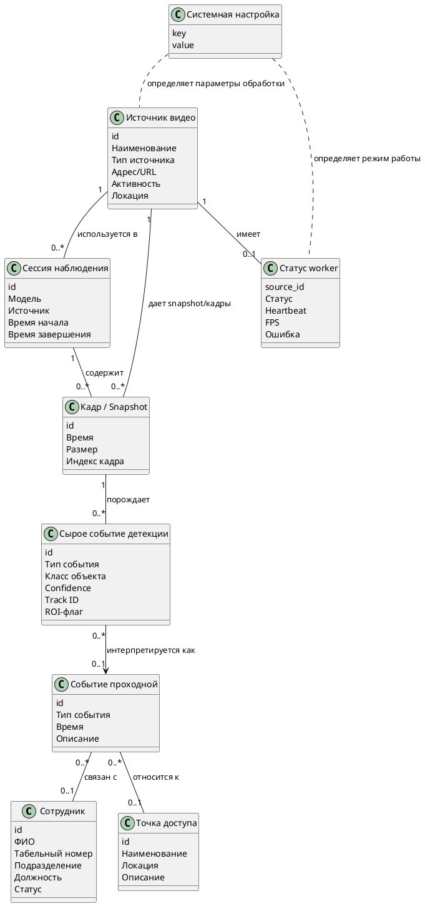
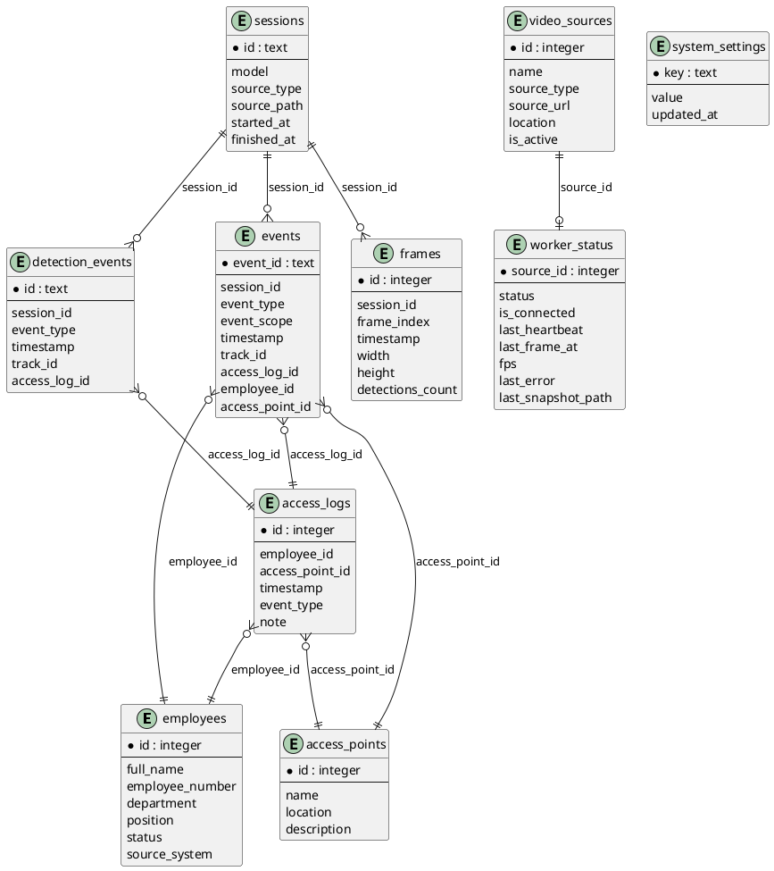
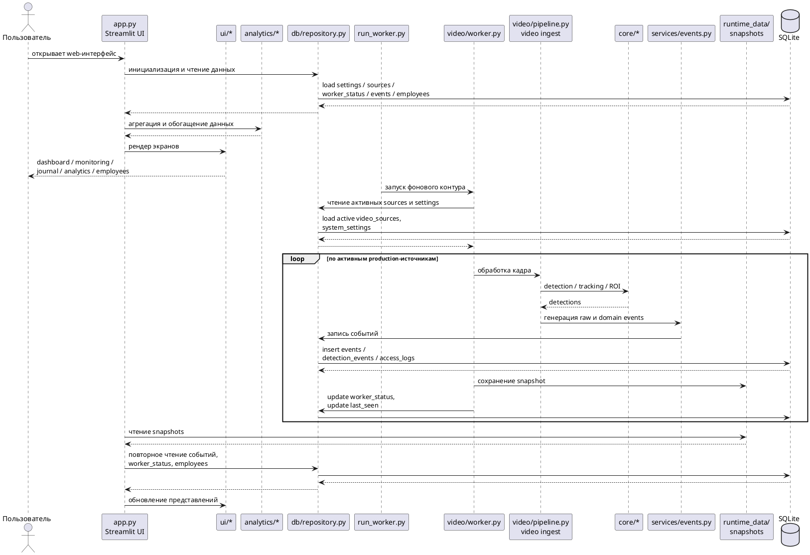
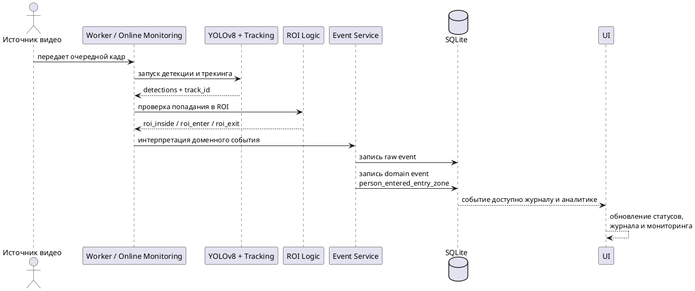
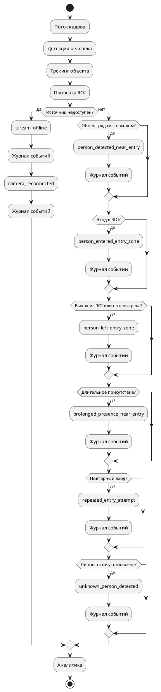

# 3. Моделирование данных и реализация системы

После проектирования архитектуры необходимо показать, как она реализуется в модели данных и программных модулях. В данной главе рассматриваются логическая модель предметной области, физическая схема хранения, взаимодействие интерфейсного и фонового контуров, реализация событийной логики, а также прикладные подсистемы журнала, аналитики и справочника сотрудников.

## 3.1. Логическое моделирование предметной области

Логическая модель предметной области фиксирует базовые сущности системы и их участие в прикладных сценариях. Для рассматриваемого проекта это особенно важно, поскольку решение объединяет видеомониторинг, автоматическую обработку видеопотока, событийную интерпретацию результатов, хранение истории и аналитическое представление накопленных данных. Модель должна отражать не только технические объекты, но и их место в общей цепочке наблюдения.

Предметная область строится вокруг контролируемой входной зоны предприятия. Исходным объектом является источник видео, поставляющий кадры для обработки. На уровне вычислительного контура кадр анализируется средствами детекции и трекинга, после чего результат соотносится с ROI как входной зоной. Если состояние объекта приобретает прикладной смысл, формируется событие проходной, которое записывается в журнал и далее используется аналитикой. Таким образом, логическая модель охватывает как визуально-вычислительный, так и организационный контур.

Для систематизации сущностей целесообразно выделить четыре группы: организационные, мониторинговые, событийные и служебные. Организационную группу образуют сотрудник и точка доступа. Сотрудник задает кадровый контекст событий и используется для ручной привязки записей, а точка доступа определяет прикладную зону, к которой относится событие проходной.

Мониторинговая группа включает источник видео, кадр или snapshot и сессию наблюдения. Источник поставляет поток данных, кадр выступает единицей визуальной информации, snapshot фиксирует текущее состояние канала для отображения, а сессия наблюдения связывает обработку, параметры запуска и накопленные результаты в рамках одного рабочего цикла.

Событийную группу образуют сырое событие детекции и событие проходной. Первое отражает непосредственный результат детекции и трекинга, второе представляет его предметную интерпретацию: появление у входа, вход в ROI, выход из нее, длительное присутствие, повторный вход либо изменение состояния источника. Служебная группа включает системную настройку и статус worker, обеспечивающие управление параметрами системы и контроль устойчивости production-контура.

Причинно-следственная цепочка предметной области имеет вид: источник видео → кадр → детекция → трекинг и ROI → предметное событие → запись в журнал → аналитика. Именно эта последовательность связывает вычислительный результат с прикладным смыслом и объясняет, почему система не сводится ни к обычному видеонаблюдению, ни к отдельному CV-алгоритму.

Таблица 3.1. Группы сущностей предметной области

| Группа сущностей | Сущности | Назначение |
| --- | --- | --- |
| Организационные | Сотрудник, Точка доступа | Задают организационный контекст событий и связывают наблюдение с инфраструктурой предприятия |
| Мониторинговые | Источник видео, Кадр / Snapshot, Сессия наблюдения | Описывают процесс получения и обработки видеоданных |
| Событийные | Сырое событие детекции, Событие проходной | Отражают результаты обработки и их предметную интерпретацию |
| Служебные | Системная настройка, Статус worker | Обеспечивают управление параметрами системы и контроль ее эксплуатационного состояния |

Таблица 3.2. Ключевые сущности предметной области и их смысл

| Сущность | Смысл в предметной области |
| --- | --- |
| Сотрудник | Справочная карточка работника предприятия, используемая для организационного контекста и ручной привязки событий |
| Источник видео | Камера или поток данных, поставляющий визуальную информацию в систему |
| Точка доступа | Контролируемая входная зона, с которой связываются предметные события проходной |
| Сессия наблюдения | Отдельный цикл обработки видеопотока с заданными параметрами и источником |
| Кадр / Snapshot | Единица визуальных данных или зафиксированное текущее состояние источника |
| Сырое событие детекции | Низкоуровневый результат детекции и трекинга, возникающий непосредственно при анализе кадра |
| Событие проходной | Предметно интерпретированный факт, отражающий состояние контролируемой зоны |
| Системная настройка | Параметр, определяющий режим работы системы |
| Статус worker | Служебная информация о состоянии фоновой обработки и доступности источника |

Логическая модель показывает, что прикладная ценность системы формируется на уровне связанной структуры сущностей, а не на уровне отдельных кадров. Она служит основанием для физической модели хранения и последующей программной реализации.

Рисунок 3.1 – Логическая модель предметной области веб-системы мониторинга и интеллектуального анализа объектов

Диаграмма фиксирует связи между организационным, мониторинговым, событийным и служебным контурами системы. Она показывает, каким образом результаты детекции становятся событиями, журналом и аналитикой.

## 3.2. Физическое моделирование базы данных

Физическая модель данных реализована на базе `SQLite` и объединяет предметные, справочные и служебные данные в едином хранилище. Такой выбор соответствует архитектуре проекта, в которой Streamlit UI, фоновый worker, журнал событий и аналитические представления работают с общей базой и не требуют отдельного сервера СУБД.

Ядро схемы образуют таблицы `employees`, `access_points`, `access_logs`, `detection_events`, `video_sources`, `system_settings`, `worker_status`, `sessions`, `frames` и `events`. Их роли различаются по уровню прикладного смысла. `employees` хранит локальный справочник сотрудников и одновременно выполняет роль кэша при удаленной синхронизации. `access_points` задает словарь контролируемых зон. `video_sources` описывает камеры и иные каналы видеоданных, а `worker_status` фиксирует текущее состояние production-обработки по каждому источнику, включая heartbeat, время последнего кадра, FPS, ошибки и путь к snapshot.

`system_settings` выполняет роль конфигурационного хранилища. `sessions` и `frames` поддерживают сценарии, в которых важно фиксировать параметры запуска и историю обработки кадров. Центральным же узлом схемы выступают `events`, `detection_events` и `access_logs`. Таблица `events` используется как общий журнал системы; `detection_events` сохраняет низкоуровневую телеметрию детекции и трекинга; `access_logs` хранит предметный слой проходной, где событие уже связано с сотрудником, точкой доступа и прикладным контекстом.

Связи между таблицами подчинены событийной логике системы. `video_sources` задает набор наблюдаемых каналов, `sessions` объединяет события и кадры конкретного цикла обработки, `events` и `detection_events` фиксируют результаты вычислительного и доменного контуров, а `access_logs` связывает эти результаты с `employees` и `access_points`. Такая структура позволяет одновременно поддерживать операторский журнал, аналитику, контроль состояния worker и работу со справочником сотрудников.

Выбор `SQLite` оправдан для учебно-прикладного прототипа простотой сопровождения, переносимостью и низкими инфраструктурными требованиями. Единый файл базы данных удобен для демонстрации, архивирования и контейнерного развертывания. Вместе с тем такой выбор имеет ограничения: `SQLite` не предназначена для высококонкурентной многопользовательской записи и крупного распределенного контура. При масштабировании системы закономерно потребуется переход к серверной СУБД.

Логически важна индексация полей, по которым чаще всего выполняются выборки и сортировка: временных меток событий и кадров, идентификаторов сессий, источников, типов событий, сотрудников и точек доступа. Именно эти данные лежат в основе журнала, дашборда и аналитических запросов.

Рисунок 3.2 – Схема базы данных веб-системы мониторинга и интеллектуального анализа объектов

Диаграмма отражает физическую организацию хранения в текущем прототипе. В ней показаны реальные таблицы проекта и основные логические связи между источниками, журналом событий, сотрудниками и служебными состояниями.

## 3.3. Реализация интерфейсной, фоновой и прикладной частей приложения

Проект реализован не по классической схеме backend/frontend, а как совокупность согласованных контуров: Streamlit UI, отдельного worker-процесса, модулей video ingest и `core`, сервисного слоя `services`, хранилища `db` и аналитического слоя `analytics`. Такое построение соответствует фактической архитектуре репозитория и позволяет разделить пользовательский жизненный цикл и непрерывную production-обработку.

Пользователь инициирует сценарии через `app.py`, который является точкой входа интерфейса. Он загружает настройки, источники видео, журнал, сотрудников, значения `worker_status` и затем маршрутизирует пользователя по разделам приложения. Через UI выбираются режимы мониторинга, управляются источники, просматриваются snapshots, фильтруется журнал, анализируются события и запускается синхронизация employee directory. Тем самым интерфейс управляет состоянием системы и отображает уже накопленные данные, но не является владельцем production-видеопотока.

Фоновая обработка запускается через `run_worker.py`, который поднимает отдельный процесс на базе `video.worker`. Worker получает из базы активные источники и параметры обработки, читает кадры, выполняет переподключение при ошибках, передает данные в `video/pipeline.py`, сохраняет snapshots и обновляет `worker_status`. Сервисный слой `services/events.py` преобразует результаты детекции и трекинга в сырые и предметные события, после чего они записываются в `SQLite` через `db/repository.py`.

Интерфейс получает состояние системы из двух источников: базы данных и runtime-каталога snapshots. На этой основе отображаются сводные показатели дашборда, статусы камер, журнал событий, аналитические агрегаты и справочник сотрудников. `app.py` и `run_worker.py` не обмениваются данными напрямую; их согласованность обеспечивается через общее хранилище и общие настройки. Благодаря этому production-обработка продолжается независимо от пользовательской сессии, а интерфейс может работать даже при временной недоступности worker, используя уже накопленные записи и последние snapshots.

Рисунок 3.3 – Диаграмма взаимодействия интерфейсной, фоновой и прикладной частей системы

Диаграмма показывает, как Streamlit UI, worker, сервисный слой и база данных образуют единый контур мониторинга. Взаимодействие реализовано через общее хранилище и snapshots, а не через прямой сетевой API.

## 3.4. Реализация модулей мониторинга, обработки видеопотока и событийной логики

Предметное ядро системы строится вокруг обработки видеопотока в реальном времени и его перевода в события проходной. В текущей реализации для детекции и трекинга людей используется `YOLOv8` через библиотеку Ultralytics; в production-контуре применяется встроенный tracking с конфигурацией `ByteTrack`. Обработка ориентирована на класс `person`, что соответствует фактической предметной области проекта.

Вычислительный конвейер включает получение кадра, нейросетевой инференс, выделение bounding boxes и track ID, проверку положения объекта относительно ROI и передачу результата в сервис событий. ROI интерпретируется как входная зона предприятия, поэтому детекция становится основанием для прикладной, а не только технической интерпретации. Система сохраняет два уровня событий: `detection_events` как низкоуровневую телеметрию обработки и предметные события проходной как слой, значимый для оператора, журнала и аналитики.

В доменной логике реализованы события `person_detected_near_entry`, `person_entered_entry_zone`, `person_left_entry_zone`, `prolonged_presence_near_entry`, `unknown_person_detected`, `repeated_entry_attempt`, `stream_offline` и `camera_reconnected`. Первые пять описывают состояние человека относительно входной зоны, а два последних отражают жизненный цикл источника. Такое объединение важно для прикладного контура: оператор видит не только поведение объектов, но и качество самого наблюдения.

Система поддерживает multi-source monitoring, при котором каждый источник имеет собственные события, snapshot и состояние worker. `live-window` дополняет этот сценарий отдельным окном для выбранного канала, не подменяя основной production-контур. Принципиально различаются `production path`, где активные серверные источники непрерывно обрабатываются worker-процессом, и `demo/fallback path`, охватывающий browser live, локальную камеру и файловые сценарии. Такое разделение делает архитектуру честной и эксплуатационно устойчивой.

Устойчивость обработки обеспечивается ведением отдельного состояния для каждого источника, повторными попытками подключения, фиксацией `stream_offline`, регистрацией `camera_reconnected` и сохранением snapshots. При этом полноценная биометрическая идентификация сотрудников в текущей версии не реализована: в проекте есть `identity_service`, подготовленные поля журнала и интеграция со справочником сотрудников, но завершенного контура распознавания лиц пока нет. Архитектура, однако, уже подготовлена к дальнейшему развитию в этом направлении.

Рисунок 3.4 – Диаграмма последовательности обработки события входа в контролируемую зону

Диаграмма показывает ключевой прикладной сценарий: от поступления кадра до записи доменного события в журнал. Она фиксирует место детекции, проверки ROI и событийной интерпретации.

Рисунок 3.5 – Схема событийной логики проходной зоны

Схема отражает условия формирования основных предметных и служебных событий. Она показывает, как результаты анализа потока превращаются в журнал и затем используются в аналитическом контуре.

## 3.5. Реализация аналитики, журнала событий, экспорта и справочника сотрудников

Завершающий прикладной слой системы формируется журналом событий, аналитикой, экспортом и справочным контуром сотрудников. Именно он переводит результаты нейросетевой обработки из вычислительного контура в эксплуатационное приложение, пригодное для наблюдения, анализа и документирования.

Журнал событий строится поверх таблицы `events` и дополнительно связывается с источниками, точками доступа, состояниями worker и карточками сотрудников. В интерфейсе отображаются временная метка, тип события, его уровень, источник, сотрудник, статус связи и confidence. Благодаря этому пользователь видит не набор разрозненных технических записей, а структурированную историю наблюдений, где различаются raw- и domain-события. Фильтрация выполняется по периоду, типу события, источнику, уровню, сотруднику и статусу, а карточка события позволяет перейти от общей таблицы к более детальному контексту записи.

Подсистема аналитики строится на тех же накопленных событиях и служебных данных. Через `analytics/access.py` и `ui/analytics_views.py` формируются агрегаты по времени, типам событий, точкам доступа, длительным присутствиям, offline/reconnect-событиям и отдельным источникам. Часть этих же агрегатов используется на дашборде. Такой подход позволяет анализировать не только единичные эпизоды, но и динамику системы в целом.

Журнал поддерживает экспорт выборки в CSV. Для прикладного контура это означает возможность внешней отчетности и передачи результатов наблюдения, а для демонстрационного — документирование работы прототипа вне пользовательской сессии.

Справочник сотрудников реализован через абстракцию `EmployeeRepository`, которая отделяет интерфейс от способа получения данных о персонале. В локальном режиме используется `LocalEmployeeRepository`, работающий поверх `SQLite`; для интеграционных сценариев предусмотрен `RemoteEmployeeRepository`. В конфигурации обозначены режимы `sqlite`, `api`, `supabase`, `postgres` и `mysql`, однако фактическая удаленная синхронизация реализована для `api` и `supabase`, тогда как остальные варианты остаются архитектурным резервом. Независимо от источника ключевым элементом служит локальный кэш сотрудников в таблице `employees`.

Справочный контур сопровождается состоянием синхронизации: пользователь видит `sync status`, время последнего обновления и ошибки. При недоступности удаленного employee directory система переходит в fallback read-only режим и продолжает работать с локальным кэшем. Это позволяет сохранить кадровый контекст событий даже при частичной деградации внешней интеграции.

В совокупности журнал, аналитика, экспорт и employee directory завершают прикладную реализацию системы. Они обеспечивают не только мониторинг и обработку видеоданных, но и сопровождение результатов наблюдения в едином эксплуатационном контуре.

Текстовая схема подсистемы аналитики:

- Источник данных: `events`, `worker_status`, `video_sources`, `access_points`, `employees`.
- Слой агрегации: функции `analytics/access.py`, рассчитывающие KPI, распределения по времени, статистику по типам событий, точкам доступа и источникам.
- Слой представления: `ui/dashboard.py` и `ui/analytics_views.py`.
- Прикладной результат: dashboard-показатели, аналитические графики, таблицы offline/reconnect-событий, сводки по входам в зону и по длительным присутствиям.
