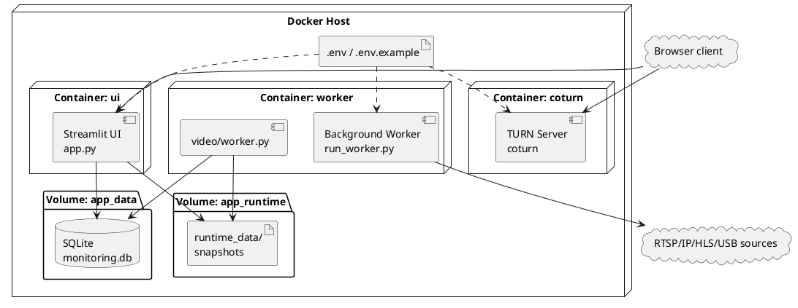

# 4. Обеспечение надежности и развертывание системы

После описания реализации системы необходимо рассмотреть условия ее устойчивой эксплуатации. Для проекта, работающего с видеопотоками в реальном времени, важны надежность источников, корректность хранения событий и состояний, воспроизводимость окружения и возможность серверного развертывания.

## 4.1. Обеспечение корректной работы источников видео и эксплуатационных режимов

Система поддерживает RTSP/IP-камеры, потоковые HLS/HTTP-источники, серверные USB-камеры, локальную камеру устройства пользователя и browser live-сценарии. Для каждого класса важны разные механизмы доступа, поэтому надежность обеспечивается разделением эксплуатационных контуров.

Основным режимом является `production path`, в котором активные server-side источники обрабатываются выделенным worker-процессом. Такой контур обеспечивает непрерывность мониторинга независимо от пользовательской сессии, поддерживает переподключение, обновляет `worker_status`, сохраняет snapshots и формирует события `stream_offline` и `camera_reconnected`.

Browser live относится к другому классу сценариев. Он опирается на камеру устройства пользователя, работает в пределах браузерной сессии и зависит от WebRTC-инфраструктуры. Для него существенны Python 3.11, совместимый стек `streamlit-webrtc`, HTTPS и наличие STUN/TURN-сервера. В проекте для этого предусмотрен `coturn`.

Принципиально важно разделение client-side и server-side доступа к камерам. Server-side контур обеспечивает постоянную обработку камер, доступных хосту приложения. Client-side контур ограничен локальным устройством пользователя и существует только во время активного сеанса.

Надежность системы поддерживается диагностикой и fallback-механизмами. Состояние каждого источника отображается через `worker_status`, что позволяет отличать отсутствие событий от недоступности камеры. При частичных отказах система сохраняет доступ к уже накопленным событиям, snapshots, журналу и локальному кэшу сотрудников.

## 4.2. Обеспечение целостности и надежности данных

Центральным хранилищем проекта является `SQLite`, используемая для сохранения сотрудников, источников видео, событий, системных настроек, сеансов, сведений о кадрах и состояний фонового worker. Для текущего формата разработки такой выбор оправдан простотой развертывания и достаточностью для учебно-прикладного прототипа.

Важной частью надежности является инициализация схемы хранения при запуске. Модуль `db/repository.py` отвечает за создание таблиц и проверку актуальности структуры. В событийном слое данные разделены на `detection_events` и предметные события проходной, что позволяет сохранять вычислительную телеметрию и доменную интерпретацию без смешения уровней.

Дополнительную роль играют snapshots и `worker_status`. Snapshot фиксирует последнее доступное визуальное состояние production-источника, а `worker_status` содержит сведения о heartbeat, времени последнего кадра, FPS, ошибках и соединении.

Для справочника сотрудников реализован локальный кэш, что важно при работе с удаленным employee directory. Если внешний источник недоступен, система сохраняет возможность чтения уже синхронизированных записей и переходит в fallback read-only режим. При этом `SQLite` подходит для прототипа и умеренной нагрузки, но не рассчитана на крупный промышленный контур.

Надежность системы определяется не только выбором СУБД, но и устойчивостью событийной логики. Поэтому целостность данных в проекте обеспечивается совместной работой слоя хранения и прикладной логики.

## 4.3. Организация контейнерной среды разработки

Контейнерная среда проекта описана в `docker-compose.yml` и включает сервисы `ui`, `worker` и `coturn`. Контейнер `ui` запускает Streamlit-приложение, `worker` обслуживает production-контур обработки видеопотоков, а `coturn` поддерживает TURN/STUN-инфраструктуру для browser live-сценариев. Такая конфигурация соответствует фактической архитектуре приложения и отделяет интерфейс, фоновую обработку и сетевой live-контур.

Для сохранения состояния используются общие volumes. В `app_data` хранится `SQLite`-база данных, а в runtime-volume — snapshots и связанные служебные файлы. `.env.example` выполняет роль шаблона конфигурации и делает параметры окружения воспроизводимыми.

Контейнеризация упрощает переносимость проекта, локальную отладку и демонстрацию. Один и тот же compose-контур может использоваться на машине разработчика и в серверном прототипе.

Рисунок 4.1 – Диаграмма развертывания контейнерной среды веб-системы мониторинга

Диаграмма показывает состав контейнерного окружения и связи между пользовательским интерфейсом, worker, TURN-сервисом и хранилищем данных. Она отражает реальный сценарий развертывания проекта в воспроизводимом многосервисном контуре.

## 4.4. Развертывание системы в серверном контуре

Система может быть развернута на VPS или выделенном сервере как прикладной прототип. В серверном сценарии compose-контур поднимает `ui`, `worker` и `coturn`; `worker` получает доступ к production-источникам видео, `ui` обслуживает web-интерфейс, а `coturn` обеспечивает удаленные browser live-сценарии.

Серверное развертывание принципиально отличается от локальной демонстрации. В production deployment приоритет получают непрерывная server-side обработка, сохранность накопленных данных и предсказуемый сетевой доступ. Browser live в этом контуре остается вспомогательным интерактивным каналом.

Практическую ценность такого развертывания усиливает `live-window`, позволяющий вынести выбранный источник в отдельное окно и сохранить основной интерфейс для работы с журналом, аналитикой и настройками. В совокупности использование `Docker Compose`, volumes, HTTPS и `coturn` позволяет рассматривать проект как воспроизводимый web-прототип.
