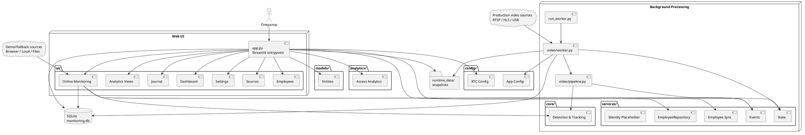
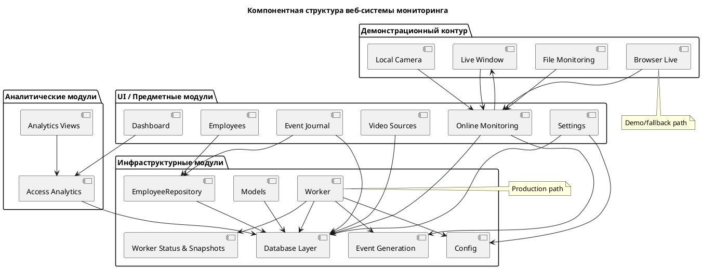
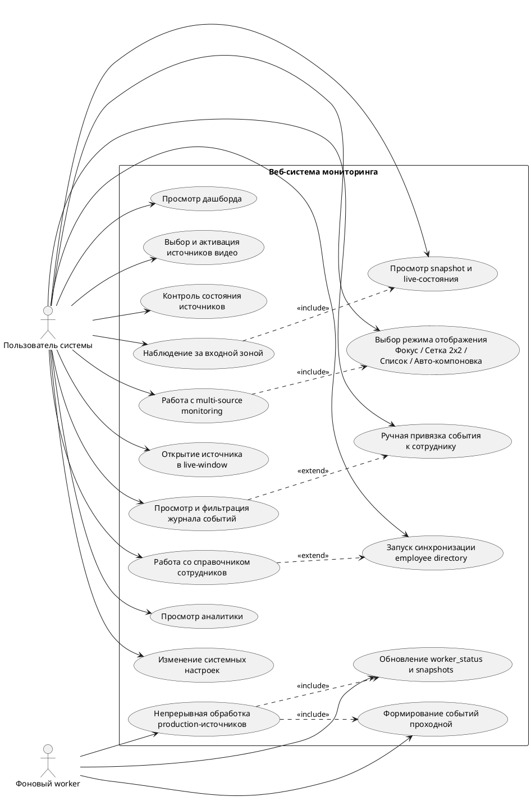
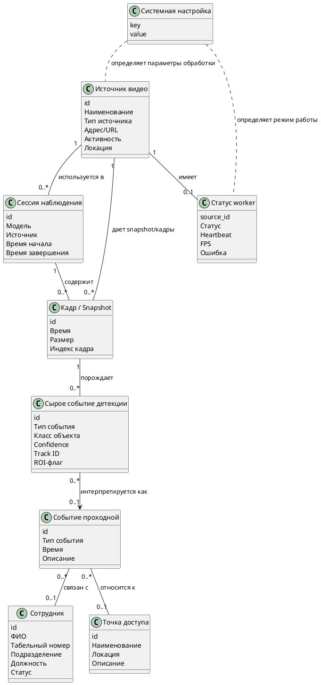
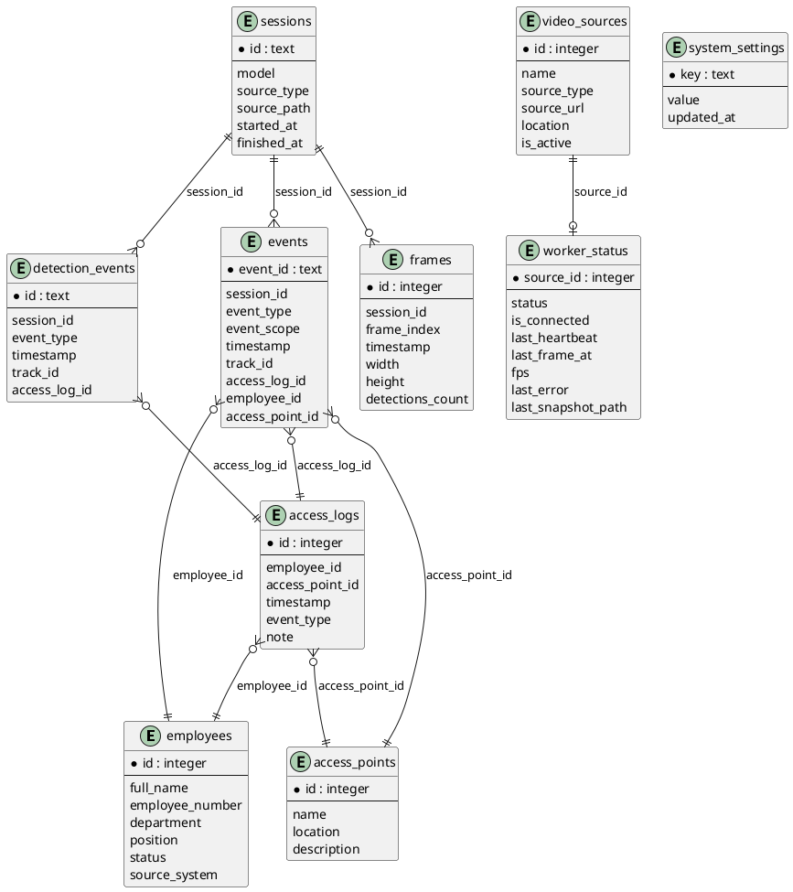
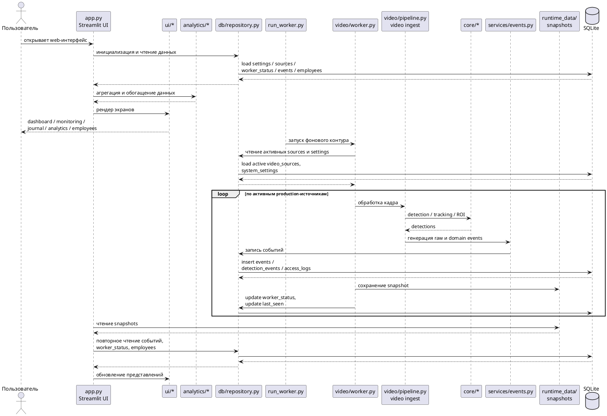
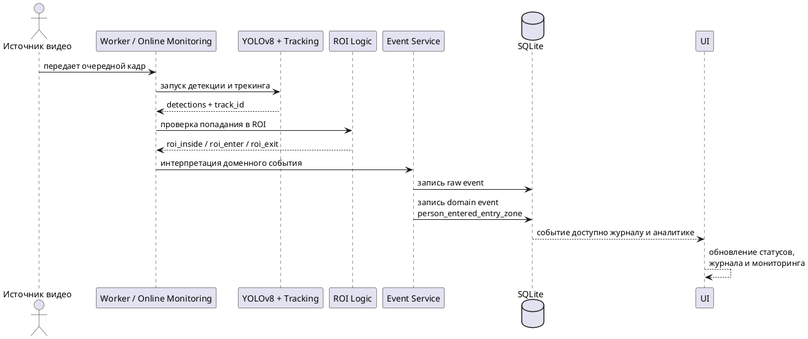
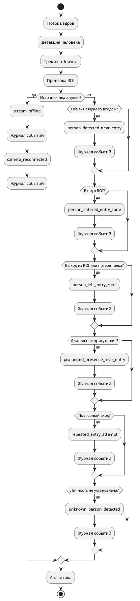
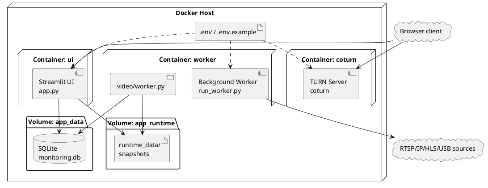

## Реферат

Выпускная квалификационная работа посвящена разработке веб-системы мониторинга и интеллектуального анализа объектов в реальном времени с использованием нейросетевых моделей. Актуальность темы обусловлена ростом потребности в автоматизации процессов видеомониторинга на объектах предприятия, необходимостью оперативного выявления событий в контролируемых зонах и повышением информативности видеонаблюдения за счет интеллектуальной обработки видеопотока. Традиционные средства наблюдения, основанные преимущественно на ручном просмотре камер и разрозненном хранении данных, затрудняют своевременное обнаружение значимых ситуаций, не обеспечивают удобного накопления событийной истории и ограничивают возможности последующего анализа. В этих условиях особую значимость приобретают программные решения, сочетающие обработку видеоданных в реальном времени, интерпретацию событий предметной области и веб-доступ к результатам мониторинга.

Целью работы является разработка веб-системы, обеспечивающей мониторинг входной зоны предприятия и интеллектуальный анализ видеопотоков в реальном времени на основе нейросетевой детекции и трекинга объектов, а также накопление, визуализацию и аналитическую обработку событий наблюдения. Для достижения поставленной цели в работе решены задачи анализа предметной области автоматизированного видеомониторинга, формирования требований к системе, проектирования архитектуры приложения, моделирования структуры данных, реализации пользовательского веб-интерфейса, разработки выделенного фонового worker-процесса для непрерывной обработки источников видео, интеграции нейросетевой модели YOLOv8 для детекции и трекинга людей, реализации событийной логики проходной, ведения журнала событий, построения аналитических представлений, организации работы со справочником сотрудников, поддержки мониторинга нескольких источников видеоданных и подготовки контейнерного контура развертывания с использованием Docker Compose.

Объектом исследования являются процессы мониторинга объектов и событий в видеопотоке в условиях реального времени. Предмет исследования составляют методы, модели и программные средства построения веб-систем видеомониторинга, включающих нейросетевую обработку кадров, событийную интерпретацию результатов детекции, хранение истории наблюдений и представление аналитической информации пользователю.

Практическим результатом работы является функционирующий программный продукт, реализованный на основе Streamlit в качестве веб-интерфейса, SQLite в качестве локального хранилища данных, выделенного фонового worker для production-обработки активных источников и модели YOLOv8 для детекции и трекинга людей. В системе реализованы multi-source monitoring, управление источниками видеоданных, отдельное live-window для оперативного просмотра, журнал событий проходной, аналитические экраны, справочник сотрудников, хранение системных настроек и состояний обработки, а также разделение эксплуатационного контура на production path и demo/fallback path. В production path обработка активных RTSP/IP, USB и потоковых источников выполняется фоновым worker-процессом с сохранением snapshots и обновлением статусов источников, тогда как demo/fallback path предназначен для локальной демонстрации и включает браузерную камеру, локальную камеру и загрузку файлов без изменения базовой архитектуры системы.

Теоретическая значимость работы заключается в формализации предметной области интеллектуального видеомониторинга применительно к задаче наблюдения за входной зоной предприятия, в выделении ключевых сущностей, сценариев и типов событий, а также в обосновании архитектурного подхода, разделяющего слой веб-представления, фоновую обработку видеопотока, событийную бизнес-логику и хранилище данных. Практическая значимость определяется созданием программного средства, пригодного для учебных, демонстрационных и прикладных сценариев, связанных с контролем проходной зоны, наблюдением за состоянием источников видеоданных, накоплением событийной истории и последующим анализом результатов работы системы.

Разработанный программный продукт поддерживает обработку видеопотоков в реальном времени, детекцию и трекинг людей, интерпретацию ROI как входной зоны, формирование предметно-ориентированных событий проходной, включая появление человека у входа, вход в зону, выход из зоны, длительное присутствие, повторную попытку входа, потерю соединения с источником и восстановление камеры. Дополнительно реализованы журналирование событий, ручная привязка событий к сотрудникам из справочника, отображение оперативных и аналитических показателей, управление параметрами обработки, хранение сведений о состоянии worker и контейнеризованное развертывание системы в среде Docker Compose.

Ключевые слова: веб-система видеомониторинга, интеллектуальный анализ объектов, обработка видеопотоков в реальном времени, нейросетевые модели, YOLOv8, Streamlit, фоновый worker, журнал событий, аналитические представления, справочник сотрудников, multi-source monitoring, SQLite, Docker Compose.

## Перечень условных обозначений, сокращений и терминов

API — программный интерфейс приложения, используемый для взаимодействия между программными компонентами или для подключения к внешним сервисам.

CRUD — базовый набор операций работы с данными: создание, чтение, изменение и удаление записей.

Docker — платформа контейнеризации, применяемая для воспроизводимого запуска приложения и связанных сервисов.

Docker Compose — средство оркестрации многоконтейнерного приложения, используемое для совместного запуска веб-интерфейса, фонового worker-процесса и сетевых сервисов.

FPS — количество кадров, обрабатываемых или отображаемых за одну секунду.

HLS — протокол потоковой передачи медиаданных по HTTP, используемый как один из вариантов подключения видеоисточника.

HTTP — прикладной протокол передачи данных, применяемый при работе веб-интерфейса и сетевых видеопотоков.

HTTPS — защищенный вариант протокола HTTP, используемый при работе веб-приложения через шифрованное соединение.

IP-камера — сетевое устройство видеонаблюдения, передающее видеопоток по IP-сети.

OpenCV — библиотека компьютерного зрения, применяемая для чтения видеопотоков, обработки кадров и сохранения изображений.

ROI — область интереса на кадре, в пределах которой анализируется факт нахождения объекта; в рассматриваемой системе ROI интерпретируется как входная зона.

RTSP — сетевой протокол передачи медиапотоков в реальном времени, применяемый для подключения камер и серверных источников видео.

SQLite — встраиваемая реляционная система управления базами данных, используемая для хранения событий, справочников, настроек и служебного состояния системы.

Streamlit — фреймворк для построения веб-интерфейса на Python, используемый в проекте как основной UI-слой.

STUN — сетевой механизм определения внешних параметров подключения, используемый при организации WebRTC-взаимодействия.

TURN — сетевой механизм ретрансляции медиапотока, применяемый в случаях, когда прямое peer-to-peer соединение WebRTC затруднено или недоступно.

WebRTC — технология передачи аудио- и видеоданных в реальном времени между узлами сети; в проекте используется для браузерного live-режима.

Worker — выделенный фоновый процесс, выполняющий непрерывную обработку активных видеоисточников вне жизненного цикла пользовательской веб-страницы.

YOLOv8 — нейросетевая модель семейства YOLO, используемая для детекции и трекинга людей в видеопотоке.

Snapshot — сохраненный кадр, отражающий последнее доступное состояние конкретного источника видеоданных.

Event cooldown — временной интервал подавления повторных или дублирующих событий, предотвращающий избыточную регистрацию однотипных записей.

Worker status — служебное состояние фонового процесса по конкретному источнику, включающее признаки соединения, время heartbeat, время последнего кадра, FPS, ошибки и путь к snapshot.

Access log — предметная запись журнала проходной, отражающая интерпретированное событие доступа или нахождения человека в контролируемой зоне.

Detection event — низкоуровневое событие, формируемое непосредственно на основе результата детекции или трекинга в видеопотоке.

Video source — источник видеоданных, зарегистрированный в системе и используемый для мониторинга; может представлять RTSP/IP-камеру, потоковый URL, USB-камеру или браузерную камеру.

EmployeeRepository — абстракция доступа к справочнику сотрудников, поддерживающая локальный режим хранения и удаленные сценарии синхронизации.

Multi-source monitoring — режим одновременного мониторинга нескольких источников видеоданных в рамках единого интерфейса.

Live-window — отдельное окно просмотра видеопотока, предназначенное для оперативного наблюдения за выбранным источником.

Fallback mode — вспомогательный режим работы системы, используемый при демонстрации, локальной отладке или временной недоступности основного эксплуатационного контура.

Production path — основной эксплуатационный сценарий системы, в котором активные серверные источники обрабатываются выделенным worker-процессом с сохранением статусов и snapshots.

Demo path — демонстрационный сценарий работы, ориентированный на локальный запуск, браузерную камеру, локальную камеру или загрузку файлов без постоянной серверной обработки.

Точка доступа — контролируемая зона прохода, с которой связываются события входа, выхода и присутствия.

Журнал событий — совокупность сохраненных в системе записей о сырых событиях детекции и предметных событиях проходной, доступных для просмотра, фильтрации и анализа.

Справочник сотрудников — структурированный набор карточек сотрудников предприятия, используемый для отображения данных, синхронизации и ручной привязки событий.

## Введение

Современные системы видеонаблюдения на предприятии уже недостаточно рассматривать только как средство визуальной фиксации происходящего. При наличии нескольких камер и необходимости постоянного контроля входной зоны видеопоток должен преобразовываться в структурированную информацию о событиях, связанных с проходом сотрудников и состоянием источников наблюдения.

Актуальность темы определяется ограничениями традиционного подхода, основанного на ручном просмотре камер, локальных журналах и разрозненных инструментах учета. При таком способе работы снижается оперативность анализа, усложняется сопоставление событий между несколькими источниками и затрудняется накопление целостной истории наблюдений.

Практически значимой становится система, которая объединяет web-интерфейс мониторинга, непрерывную обработку видеопотоков, событийную интерпретацию результатов детекции, журналирование и аналитику. Для рассматриваемого проекта важна и архитектурная развязка между постоянным production-контуром и demo/fallback-сценариями.

Целью выпускной квалификационной работы является разработка веб-системы мониторинга и интеллектуального анализа объектов в реальном времени, ориентированной на наблюдение за входной зоной предприятия и обеспечивающей обработку видеопотоков от нескольких источников, детекцию и трекинг людей, формирование событий проходной, накопление истории наблюдений, аналитическое представление результатов и работу со справочником сотрудников.

Для достижения поставленной цели в работе решаются задачи анализа предметной области мониторинга проходной зоны предприятия; выявления ограничений традиционных способов наблюдения; формирования функциональных и нефункциональных требований; проектирования архитектуры приложения с разделением web-интерфейса, фоновой обработки и хранилища данных; моделирования предметной области и структуры базы данных; реализации интерфейса мониторинга на основе Streamlit; разработки worker-first контура обработки видеопотоков; интеграции модели YOLOv8 для детекции и трекинга людей; реализации событийной логики проходной, журнала событий, аналитических представлений и справочника сотрудников; подготовки контейнерного контура развертывания и проведения тестирования основных сценариев работы системы.

Объектом исследования являются процессы мониторинга объектов и ситуаций в видеопотоке в условиях реального времени применительно к входной зоне предприятия. Предмет исследования составляют методы, модели и программные средства построения веб-систем видеомониторинга, обеспечивающих многоканальную обработку видеопотоков, событийную интерпретацию результатов детекции, хранение и визуализацию истории наблюдений, а также аналитическую поддержку действий оператора.

Методологическую базу работы составляют анализ предметной области, структурное и модульное проектирование программной системы, логическое и физическое моделирование данных, методы разработки web-приложений, подходы к детекции и трекингу объектов в видеопотоке, а также приемы функционального и модульного тестирования. В практической части используются Streamlit, SQLite, WebRTC и модель YOLOv8.

Практическая значимость работы определяется созданием функционирующего программного средства, пригодного для демонстрационных, учебных и прикладных сценариев мониторинга входной зоны предприятия. Теоретико-методическая значимость связана с формализацией предметной области интеллектуального видеомониторинга и обоснованием архитектурного подхода, сочетающего интерфейс, фоновую обработку видеопотока, событийную логику и аналитическое представление данных.

Структура пояснительной записки отражает переход от анализа проблемы к проектированию, реализации и оценке разработанного решения. После реферата и перечня обозначений приводятся введение и литературный обзор. Далее рассматриваются предметная область и постановка задачи, архитектурные решения, моделирование данных и реализация системы, вопросы надежности и развертывания, результаты тестирования, заключение и список использованных источников.

## Литературный обзор

Разработка веб-системы мониторинга и интеллектуального анализа объектов в реальном времени опирается на видеонаблюдение, компьютерное зрение, нейросетевую детекцию и трекинг, потоковую обработку видео, web-визуализацию результатов и хранение событийных данных. Для задачи мониторинга входной зоны предприятия важно не только получать видеокадры, но и преобразовывать их в прикладные события.

Современные системы видеонаблюдения развиваются от пассивного отображения видеопотока к автоматическому выделению значимых ситуаций. Практическая ценность таких систем определяется способностью обнаруживать объекты, сопровождать их во времени и интерпретировать изменения их состояния в кадре [1], [2].

Центральное место в решении подобных задач занимает компьютерное зрение, прежде всего обнаружение и трекинг людей. Для проходной зоны предприятия важны не только факт присутствия человека, но и переходы между состояниями: появление рядом со входом, вход в контролируемую область, выход из нее и длительное присутствие. Практическую значимость такого подхода подтверждает ByteTrack, ориентированный на устойчивое сопровождение объектов в реальном времени [3].

Семейство моделей YOLO стало одним из базовых решений для real-time object detection благодаря сочетанию скорости и достаточной точности [1], [4]. Для проектирования реальной системы важно и то, что стек Ultralytics объединяет детекцию, трекинг и deployment-сценарии в едином инструментальном контуре [5]. Это делает YOLOv8 рациональным выбором для системы, в которой необходимо сочетать обработку видеопотока, интерфейсное отображение и событийную логику.

Организация потоковой обработки видео является самостоятельной инженерной задачей. OpenCV предоставляет базовые средства захвата и чтения кадров, однако не задает архитектуру уровня приложения [6]. Для системы мониторинга нескольких источников более устойчивым является вынесение production-обработки в отдельный worker-контур.

Для browser live-сценариев практическое значение имеет WebRTC. Материалы MDN и документы IETF показывают, что удаленная передача медиаданных требует учета STUN/TURN-инфраструктуры и ограничений сетевой среды [7], [8]. Документация `streamlit-webrtc` также указывает на необходимость HTTPS и корректно настроенного STUN/TURN-контура [9].

Не менее важен слой представления и аналитики. Streamlit ориентирован на быстрое создание интерактивных data-приложений и позволяет объединить мониторинг, журналирование и аналитические панели в одном web-интерфейсе [10]. Без такого уровня представления даже качественная нейросетевая обработка не превращается в удобный инструмент эксплуатации.

Журналирование и хранение событий необходимы для сохранения истории наблюдений и аналитической обработки. Для рассматриваемого проекта значимо разделение сырых detection-событий и предметных событий проходной. Использование SQLite на этапе прототипирования оправдано простотой развертывания [11], а контейнеризация через Docker Compose обеспечивает воспроизводимость многосервисной среды [12].

Проведенный обзор показывает, что для задачи мониторинга входной зоны предприятия недостаточно использовать отдельный модуль детекции, видеозахват или разрозненный интерфейс просмотра камер. Требуется единая веб-система, объединяющая видеомониторинг, событийную логику, хранение данных, аналитику и эксплуатационную устойчивость. Именно такая постановка задачи определяет целесообразность разработки собственного решения в рамках настоящей выпускной квалификационной работы.

Источники, использованные при подготовке обзора:

1. Ramos L. T., Sappa A. D. A Decade of You Only Look Once (YOLO) for Object Detection: A Review. IEEE Access, 2025. URL: https://arxiv.org/abs/2504.18586
2. Approaches to Video Real time Multi-Object Tracking and Object Detection: A survey. IEEE Xplore. URL: https://ieeexplore.ieee.org/document/9552095/
3. Zhang Y. et al. ByteTrack: Multi-Object Tracking by Associating Every Detection Box. ECCV, 2022. URL: https://arxiv.org/abs/2110.06864
4. Redmon J. et al. You Only Look Once: Unified, Real-Time Object Detection. CVPR, 2016. URL: https://openaccess.thecvf.com/content_cvpr_2016/html/Redmon_You_Only_Look_CVPR_2016_paper.html
5. Ultralytics YOLO Documentation. URL: https://docs.ultralytics.com/
6. OpenCV Documentation: `VideoCapture` Class Reference. URL: https://docs.opencv.org/3.4/d8/dfe/classcv_1_1VideoCapture.html
7. MDN Web Docs. Introduction to WebRTC protocols. URL: https://developer.mozilla.org/en-US/docs/Web/API/WebRTC_API/Protocols
8. Mahy R. et al. RFC 5766: Traversal Using Relays around NAT (TURN). IETF. URL: https://www.ietf.org/ietf-ftp/rfc/rfc5766.txt.pdf
9. `streamlit-webrtc` Documentation / GitHub README. URL: https://github.com/whitphx/streamlit-webrtc
10. Streamlit Documentation. URL: https://docs.streamlit.io/
11. SQLite Documentation: About SQLite. URL: https://www.sqlite.org/about.html
12. Docker Documentation: Docker Compose. URL: https://docs.docker.com/compose/

# 1. Анализ предметной области и постановка задачи

Исследование предметной области необходимо для того, чтобы связать технические возможности системы с реальными условиями ее применения. Для рассматриваемой работы это означает анализ мониторинга прохода сотрудников через входную зону предприятия, ограничений традиционных средств наблюдения, существующих классов программных решений и требований к системе, которая должна не только отображать видеопоток, но и формировать события, хранить историю наблюдений и поддерживать аналитическую интерпретацию накопленных данных.

## 1.1. Особенности мониторинга прохода сотрудников на предприятии

Мониторинг прохода сотрудников относится к прикладным задачам, в которых видеонаблюдение выступает лишь исходным источником данных. Практическую ценность представляет не сам поток кадров, а интерпретация поведения человека относительно входной зоны: появление у прохода, вход в контролируемую область, выход из нее, повторное появление, длительное присутствие и состояние самих средств наблюдения. Поэтому система должна работать на пересечении видеомониторинга, компьютерного зрения, хранения данных и прикладной эксплуатационной логики.

Входная зона предприятия является организационно значимым участком инфраструктуры. Именно здесь пересекаются физическое перемещение персонала, контроль доступности камер и потребность в оперативной фиксации событий. Для решения такой задачи недостаточно просто показывать изображение оператору. Необходимо связывать каждое наблюдение с конкретным источником видео, временем, точкой доступа и последующей записью в журнал, пригодный для поиска, фильтрации и анализа.

Дополнительную сложность создает работа с несколькими источниками видеоданных. В прикладном контуре могут использоваться RTSP/IP-камеры, потоковые URL, серверные USB-камеры, а также браузерные и локальные источники, применяемые в демонстрационных сценариях. Отсюда возникает требование multi-source monitoring: система должна не только анализировать кадры, но и показывать состояние каждого источника, его доступность, время последнего кадра, текущий snapshot и диагностическую информацию.

Ключевым понятием предметной области выступает ROI как контролируемая область кадра. В задаче проходной ROI интерпретируется не как абстрактная зона интереса, а как входная зона предприятия. Благодаря этому результаты детекции и трекинга приобретают предметный смысл и становятся основанием для формирования событий проходной. Видеопоток, журналирование и аналитика здесь образуют единый контур: низкоуровневые результаты обработки преобразуются в записи журнала, а накопленные события используются для построения аналитических представлений по времени, источникам и точкам доступа.

Справочник сотрудников дополняет этот контур организационным контекстом. Он позволяет сопоставлять события с кадровыми данными, выполнять ручную привязку записей и использовать сведения о подразделении, должности и статусе работника при интерпретации наблюдений. Тем самым задача мониторинга проходной становится междисциплинарной: она объединяет обработку видеопотока, детекцию и трекинг, web-мониторинг, хранение данных, событийную логику и эксплуатацию прикладной системы.

## 1.2. Анализ существующих проблем и ограничений традиционных подходов

Традиционные подходы к контролю проходной зоны ориентированы главным образом на отображение и архивирование видеопотока. При ручном наблюдении оператор вынужден одновременно отслеживать несколько каналов, самостоятельно интерпретировать происходящее и, при необходимости, фиксировать результаты во внешнем журнале. По мере роста числа камер и длительности наблюдения такой подход теряет оперативность, повышает вероятность пропуска значимых ситуаций и делает оценку происходящего заведомо субъективной.

Обычные видеорегистраторы упрощают хранение архива, но не решают задачу предметной интерпретации. Они не формируют структурированные события, не различают вход в контролируемую область и длительное присутствие рядом с ней, а поиск нужного эпизода по архиву по-прежнему требует ручного просмотра. При использовании нескольких камер трудоемкость возрастает еще сильнее, поскольку оператору приходится синхронизировать временные фрагменты и сопоставлять записи из разных источников.

Не менее существенным недостатком является использование разрозненных локальных журналов и несвязанных инструментов учета. В такой схеме видеоданные, записи оператора, сведения о состоянии камер и информация о сотрудниках существуют отдельно друг от друга. Это затрудняет проверку событий, снижает прослеживаемость и практически исключает централизованную аналитику. Отсутствие единого интерфейса и общего журнала событий особенно критично при multi-source monitoring, где оператору нужен целостный, а не фрагментированный рабочий контур.

Проблемы традиционных решений усиливаются сложностью сопровождения и развертывания. Набор локально настроенных инструментов, отдельных скриптов и демонстрационных прототипов без устойчивого эксплуатационного контура плохо воспроизводим, неудобен для расширения и слабо пригоден как для прикладного применения, так и для демонстрации результатов разработки. Это обосновывает необходимость специализированной веб-системы, в которой видеомониторинг, событийная логика, хранение данных, аналитика и справочный контур объединены в одном решении.

## 1.3. Анализ существующих программных решений

Среди аналогов можно выделить несколько классов решений. Классические системы видеонаблюдения хорошо решают задачи подключения камер, показа изображения и хранения архива, однако слабо поддерживают предметную интерпретацию событий и централизованный аналитический контур. Поэтому они полезны как база для понимания требований к отображению и записи видео, но недостаточны для интеллектуального анализа проходной зоны.

Специализированные VMS-платформы представляют более зрелый класс решений. Их сильные стороны заключаются в масштабируемости, развитом администрировании, поддержке большого числа камер и готовности к промышленной эксплуатации. Вместе с тем для учебно-прикладной ВКР их использование имеет очевидные ограничения: значительная часть архитектуры скрыта внутри платформы, настройка часто требует сложной инфраструктуры и лицензирования, а возможность показать собственные проектные решения на уровне модели данных, событийной логики и пользовательского интерфейса уменьшается. Поэтому такие системы выступают скорее ориентиром по классу задач, чем прямым шаблоном для реализации.

Решения на базе компьютерного зрения и исследовательские проекты с YOLO и OpenCV ближе к интеллектуальной части рассматриваемой темы. Их достоинства состоят в прозрачности вычислительного контура, наглядности детекции и относительной простоте адаптации алгоритмов. Однако большинство таких решений ограничивается демонстрацией обработки одного потока или файла и не включает полноценный журнал событий, multi-source monitoring, аналитику, справочник сотрудников и воспроизводимый эксплуатационный контур.

Легковесные web-приложения для мониторинга занимают промежуточное положение между исследовательскими прототипами и зрелыми платформами. Они упрощают доступ к данным и создают единый интерфейс, но нередко зависят от пользовательской сессии, слабо разделяют production- и demo-сценарии и не содержат развитой фоновой обработки. По этой причине даже наличие web-интерфейса само по себе не гарантирует эксплуатационную состоятельность решения.

Для данной работы собственная разработка оправдана методически и практически. Она позволяет сохранить прозрачность архитектуры, управляемость, возможность адаптации под задачу проходной зоны и воспроизводимое развертывание, одновременно объединяя мониторинг, события, журнал, аналитику и employee directory. Такой подход не претендует на функциональный паритет с крупными VMS-платформами, но обеспечивает баланс между инженерной целостностью и исследовательской ценностью.

## 1.4. Формирование требований к разрабатываемой системе

Проведенный анализ позволяет сформулировать требования к системе как к прикладному средству мониторинга проходной зоны предприятия. Функционально система должна обеспечивать онлайн-мониторинг входной зоны, работу с несколькими источниками видеоданных, управление video sources, разделение `production path` и `demo/fallback path`, формирование и хранение сырых и предметных событий, централизованный журнал событий, аналитические представления, работу со справочником сотрудников, поддержку удаленного employee directory через `EmployeeRepository`, отдельный `live-window`, а также сохранение snapshots и служебного состояния `worker_status`.

Нефункциональные требования связаны с устойчивостью и эксплуатационной пригодностью решения. Система должна обеспечивать непрерывную работу фонового worker-процесса, корректную обработку RTSP/IP, HLS, USB и браузерных источников, удобный и читаемый web-интерфейс, расширяемую архитектуру, воспроизводимое контейнерное развертывание, централизованное хранение событий и состояний, а для browser live — учет ограничений HTTPS и WebRTC-инфраструктуры с использованием STUN/TURN. Существенным является и требование архитектурной честности: browser live не должен подменять production-обработку, а должен существовать как отдельный сетевой контур со своими ограничениями.

Итоговая постановка задачи состоит в разработке специализированной веб-системы, обеспечивающей worker-first обработку видеопотоков в реальном времени, формирование событий проходной, централизованный журнал, аналитику, работу со справочником сотрудников и устойчивое развертывание в демонстрационном и прикладном режимах. Именно эти требования определяют дальнейшие архитектурные и реализационные решения.

# 2. Проектирование системы мониторинга и интеллектуального анализа

После анализа предметной области и формулирования требований необходимо определить архитектурные решения, обеспечивающие практическую реализацию системы. В данной главе рассматриваются общая архитектура приложения, его модульная структура, эксплуатационные режимы и ключевые пользовательские сценарии.

## 2.1. Разработка общей архитектуры системы

Фактическая архитектура проекта представляет собой многослойную Python-систему, в которой разделены пользовательский контур, фоновая обработка видеопотоков, сервисная логика, хранение данных и аналитические представления. Точкой входа интерфейса является `app.py`, а точкой входа фоновой обработки — `run_worker.py`.

Такое разделение принципиально: если бы интерфейс был владельцем production-видеопотока, обработка зависела бы от пользовательской сессии. Выделенный worker устраняет эту зависимость: он читает активные источники из базы, получает кадры, формирует события, сохраняет snapshots и обновляет `worker_status`, тогда как интерфейс работает с уже накопленными данными.

Слой компьютерного зрения распределен между каталогами `core/` и `video/`. В `core/` сосредоточены загрузка модели, работа с ROI и интерактивные сценарии, в `video/` — production-контур, включающий worker, pipeline и snapshots. `services/` отвечает за прикладную интерпретацию результатов обработки, `db/` — за хранение данных в `SQLite`, `analytics/` — за агрегированные представления, `config/` — за системные параметры, а `models/` — за базовые описания сущностей.

Поток данных имеет однозначное направление: источник передает кадры в worker или foreground-контур, далее выполняются детекция, трекинг и проверка ROI, после чего события, состояния worker и snapshots сохраняются в базе и runtime-каталоге, а интерфейс считывает эти данные и отображает пользователю. В архитектуре различаются `production path` и `demo/fallback path`, что позволяет совместить устойчивость и демонстрационную гибкость.

Рисунок 2.1 – Архитектурная схема веб-системы мониторинга и интеллектуального анализа объектов в реальном времени

Диаграмма отражает разделение системы на интерфейсный, фоновый, сервисный и аналитический контуры. В ней показано, что production-обработка выполняется отдельным worker-процессом, тогда как Streamlit-интерфейс работает с уже накопленными данными и состояниями.

## 2.2. Проектирование модульной структуры приложения

Модульная структура проекта отражает реальные пользовательские и технологические контуры. К предметным модулям относятся dashboard, online monitoring, employees, event journal и video sources. К аналитическим — `analytics/access.py` и интерфейсные представления аналитики.

Инфраструктурную основу образуют worker, event generation, `EmployeeRepository`, database layer, механизмы `worker_status` и snapshots, конфигурационный слой и модели данных. Отдельную группу составляют демонстрационные компоненты: browser live, local camera, file monitoring и `live-window`.

Такая декомпозиция отделяет предметные модули от вычислительного и эксплуатационного контура и сохраняет прозрачность архитектуры.

Рисунок 2.2 – Компонентная структура веб-системы мониторинга и интеллектуального анализа объектов

На диаграмме показана декомпозиция приложения на предметные, аналитические, инфраструктурные и демонстрационные модули. Такая структура соответствует реальному разбиению проекта по каталогам и ролям компонентов.

## 2.3. Эксплуатационные режимы и технологические контуры системы

В текущем проекте корректнее говорить не о формализованной корпоративной ролевой модели, а об эксплуатационных режимах. Первый из них — операторский режим наблюдения, охватывающий dashboard, online monitoring, журнал событий и аналитику.

Второй режим связан с конфигурацией и источниками: пользователь добавляет и редактирует video sources, управляет их активностью и изменяет параметры обработки. Третий режим относится к справочнику сотрудников и статусу синхронизации employee directory.

Отдельно существует автоматизированный технологический контур — фоновый worker. Он не является пользовательской ролью, но выполняет постоянную production-обработку активных источников, формирует события и поддерживает `worker_status`. Интерфейс отвечает за представление и управление, worker — за непрерывную обработку, конфигурационный слой — за согласованность параметров.

## 2.4. Проектирование пользовательских сценариев и интерфейса

Пользовательские сценарии системы выстроены вокруг типового цикла работы оператора. Начальной точкой служит дашборд, после которого пользователь переходит к monitoring, журналу, аналитике, разделу сотрудников, источникам видео или настройкам.

Сценарий управления источниками обеспечивает добавление, редактирование, тестирование и активацию video sources. Сопровождение worker реализовано через просмотр `worker_status`, времени последнего кадра, heartbeat, ошибок и snapshots.

Центральным прикладным сценарием остается наблюдение за входной зоной. В online monitoring доступны production-источники, snapshots и interactive-сценарии. Интерфейс поддерживает multi-source monitoring с режимами «Фокус», «Сетка 2x2», «Список» и «Авто-компоновка», а `live-window` позволяет вынести выбранный источник в отдельное окно.

Отдельные сценарии связаны с журналом событий, аналитикой и справочником сотрудников. Журнал поддерживает фильтрацию, карточку события, ручную привязку к сотруднику и экспорт выборки. Аналитический раздел предоставляет агрегаты по времени, типам событий, точкам доступа и состоянию источников. Раздел сотрудников поддерживает локальный и удаленный режимы работы со справочником.

Интерфейс также должен честно различать `production monitoring` и `demo/fallback` режимы. Первое опирается на server-side обработку worker, второе — на browser live, локальную камеру и файловые сценарии в пределах пользовательской сессии.

Рисунок 2.3 – Диаграмма вариантов использования веб-системы мониторинга и интеллектуального анализа объектов

Диаграмма фиксирует основные действия пользователя и автономные функции фонового worker. Она показывает, какие сценарии доступны через интерфейс и какие процессы система выполняет без участия оператора.

# 3. Моделирование данных и реализация системы

После проектирования архитектуры необходимо показать, как она реализуется в модели данных и программных модулях. В данной главе рассматриваются логическая модель предметной области, физическая схема хранения, взаимодействие интерфейсного и фонового контуров, реализация событийной логики, а также прикладные подсистемы журнала, аналитики и справочника сотрудников.

## 3.1. Логическое моделирование предметной области

Логическая модель предметной области фиксирует базовые сущности системы и их участие в прикладных сценариях. Для рассматриваемого проекта это особенно важно, поскольку решение объединяет видеомониторинг, автоматическую обработку видеопотока, событийную интерпретацию результатов, хранение истории и аналитическое представление накопленных данных. Модель должна отражать не только технические объекты, но и их место в общей цепочке наблюдения.

Предметная область строится вокруг контролируемой входной зоны предприятия. Исходным объектом является источник видео, поставляющий кадры для обработки. На уровне вычислительного контура кадр анализируется средствами детекции и трекинга, после чего результат соотносится с ROI как входной зоной. Если состояние объекта приобретает прикладной смысл, формируется событие проходной, которое записывается в журнал и далее используется аналитикой. Таким образом, логическая модель охватывает как визуально-вычислительный, так и организационный контур.

Для систематизации сущностей целесообразно выделить четыре группы: организационные, мониторинговые, событийные и служебные. Организационную группу образуют сотрудник и точка доступа. Сотрудник задает кадровый контекст событий и используется для ручной привязки записей, а точка доступа определяет прикладную зону, к которой относится событие проходной.

Мониторинговая группа включает источник видео, кадр или snapshot и сессию наблюдения. Источник поставляет поток данных, кадр выступает единицей визуальной информации, snapshot фиксирует текущее состояние канала для отображения, а сессия наблюдения связывает обработку, параметры запуска и накопленные результаты в рамках одного рабочего цикла.

Событийную группу образуют сырое событие детекции и событие проходной. Первое отражает непосредственный результат детекции и трекинга, второе представляет его предметную интерпретацию: появление у входа, вход в ROI, выход из нее, длительное присутствие, повторный вход либо изменение состояния источника. Служебная группа включает системную настройку и статус worker, обеспечивающие управление параметрами системы и контроль устойчивости production-контура.

Причинно-следственная цепочка предметной области имеет вид: источник видео → кадр → детекция → трекинг и ROI → предметное событие → запись в журнал → аналитика. Именно эта последовательность связывает вычислительный результат с прикладным смыслом и объясняет, почему система не сводится ни к обычному видеонаблюдению, ни к отдельному CV-алгоритму.

Таблица 3.1. Группы сущностей предметной области

| Группа сущностей | Сущности | Назначение |
| --- | --- | --- |
| Организационные | Сотрудник, Точка доступа | Задают организационный контекст событий и связывают наблюдение с инфраструктурой предприятия |
| Мониторинговые | Источник видео, Кадр / Snapshot, Сессия наблюдения | Описывают процесс получения и обработки видеоданных |
| Событийные | Сырое событие детекции, Событие проходной | Отражают результаты обработки и их предметную интерпретацию |
| Служебные | Системная настройка, Статус worker | Обеспечивают управление параметрами системы и контроль ее эксплуатационного состояния |

Таблица 3.2. Ключевые сущности предметной области и их смысл

| Сущность | Смысл в предметной области |
| --- | --- |
| Сотрудник | Справочная карточка работника предприятия, используемая для организационного контекста и ручной привязки событий |
| Источник видео | Камера или поток данных, поставляющий визуальную информацию в систему |
| Точка доступа | Контролируемая входная зона, с которой связываются предметные события проходной |
| Сессия наблюдения | Отдельный цикл обработки видеопотока с заданными параметрами и источником |
| Кадр / Snapshot | Единица визуальных данных или зафиксированное текущее состояние источника |
| Сырое событие детекции | Низкоуровневый результат детекции и трекинга, возникающий непосредственно при анализе кадра |
| Событие проходной | Предметно интерпретированный факт, отражающий состояние контролируемой зоны |
| Системная настройка | Параметр, определяющий режим работы системы |
| Статус worker | Служебная информация о состоянии фоновой обработки и доступности источника |

Логическая модель показывает, что прикладная ценность системы формируется на уровне связанной структуры сущностей, а не на уровне отдельных кадров. Она служит основанием для физической модели хранения и последующей программной реализации.

Рисунок 3.1 – Логическая модель предметной области веб-системы мониторинга и интеллектуального анализа объектов

Диаграмма фиксирует связи между организационным, мониторинговым, событийным и служебным контурами системы. Она показывает, каким образом результаты детекции становятся событиями, журналом и аналитикой.

## 3.2. Физическое моделирование базы данных

Физическая модель данных реализована на базе `SQLite` и объединяет предметные, справочные и служебные данные в едином хранилище. Такой выбор соответствует архитектуре проекта, в которой Streamlit UI, фоновый worker, журнал событий и аналитические представления работают с общей базой и не требуют отдельного сервера СУБД.

Ядро схемы образуют таблицы `employees`, `access_points`, `access_logs`, `detection_events`, `video_sources`, `system_settings`, `worker_status`, `sessions`, `frames` и `events`. Их роли различаются по уровню прикладного смысла. `employees` хранит локальный справочник сотрудников и одновременно выполняет роль кэша при удаленной синхронизации. `access_points` задает словарь контролируемых зон. `video_sources` описывает камеры и иные каналы видеоданных, а `worker_status` фиксирует текущее состояние production-обработки по каждому источнику, включая heartbeat, время последнего кадра, FPS, ошибки и путь к snapshot.

`system_settings` выполняет роль конфигурационного хранилища. `sessions` и `frames` поддерживают сценарии, в которых важно фиксировать параметры запуска и историю обработки кадров. Центральным же узлом схемы выступают `events`, `detection_events` и `access_logs`. Таблица `events` используется как общий журнал системы; `detection_events` сохраняет низкоуровневую телеметрию детекции и трекинга; `access_logs` хранит предметный слой проходной, где событие уже связано с сотрудником, точкой доступа и прикладным контекстом.

Связи между таблицами подчинены событийной логике системы. `video_sources` задает набор наблюдаемых каналов, `sessions` объединяет события и кадры конкретного цикла обработки, `events` и `detection_events` фиксируют результаты вычислительного и доменного контуров, а `access_logs` связывает эти результаты с `employees` и `access_points`. Такая структура позволяет одновременно поддерживать операторский журнал, аналитику, контроль состояния worker и работу со справочником сотрудников.

Выбор `SQLite` оправдан для учебно-прикладного прототипа простотой сопровождения, переносимостью и низкими инфраструктурными требованиями. Единый файл базы данных удобен для демонстрации, архивирования и контейнерного развертывания. Вместе с тем такой выбор имеет ограничения: `SQLite` не предназначена для высококонкурентной многопользовательской записи и крупного распределенного контура. При масштабировании системы закономерно потребуется переход к серверной СУБД.

Логически важна индексация полей, по которым чаще всего выполняются выборки и сортировка: временных меток событий и кадров, идентификаторов сессий, источников, типов событий, сотрудников и точек доступа. Именно эти данные лежат в основе журнала, дашборда и аналитических запросов.

Рисунок 3.2 – Схема базы данных веб-системы мониторинга и интеллектуального анализа объектов

Диаграмма отражает физическую организацию хранения в текущем прототипе. В ней показаны реальные таблицы проекта и основные логические связи между источниками, журналом событий, сотрудниками и служебными состояниями.

## 3.3. Реализация интерфейсной, фоновой и прикладной частей приложения

Проект реализован не по классической схеме backend/frontend, а как совокупность согласованных контуров: Streamlit UI, отдельного worker-процесса, модулей video ingest и `core`, сервисного слоя `services`, хранилища `db` и аналитического слоя `analytics`. Такое построение соответствует фактической архитектуре репозитория и позволяет разделить пользовательский жизненный цикл и непрерывную production-обработку.

Пользователь инициирует сценарии через `app.py`, который является точкой входа интерфейса. Он загружает настройки, источники видео, журнал, сотрудников, значения `worker_status` и затем маршрутизирует пользователя по разделам приложения. Через UI выбираются режимы мониторинга, управляются источники, просматриваются snapshots, фильтруется журнал, анализируются события и запускается синхронизация employee directory. Тем самым интерфейс управляет состоянием системы и отображает уже накопленные данные, но не является владельцем production-видеопотока.

Фоновая обработка запускается через `run_worker.py`, который поднимает отдельный процесс на базе `video.worker`. Worker получает из базы активные источники и параметры обработки, читает кадры, выполняет переподключение при ошибках, передает данные в `video/pipeline.py`, сохраняет snapshots и обновляет `worker_status`. Сервисный слой `services/events.py` преобразует результаты детекции и трекинга в сырые и предметные события, после чего они записываются в `SQLite` через `db/repository.py`.

Интерфейс получает состояние системы из двух источников: базы данных и runtime-каталога snapshots. На этой основе отображаются сводные показатели дашборда, статусы камер, журнал событий, аналитические агрегаты и справочник сотрудников. `app.py` и `run_worker.py` не обмениваются данными напрямую; их согласованность обеспечивается через общее хранилище и общие настройки. Благодаря этому production-обработка продолжается независимо от пользовательской сессии, а интерфейс может работать даже при временной недоступности worker, используя уже накопленные записи и последние snapshots.

Рисунок 3.3 – Диаграмма взаимодействия интерфейсной, фоновой и прикладной частей системы

Диаграмма показывает, как Streamlit UI, worker, сервисный слой и база данных образуют единый контур мониторинга. Взаимодействие реализовано через общее хранилище и snapshots, а не через прямой сетевой API.

## 3.4. Реализация модулей мониторинга, обработки видеопотока и событийной логики

Предметное ядро системы строится вокруг обработки видеопотока в реальном времени и его перевода в события проходной. В текущей реализации для детекции и трекинга людей используется `YOLOv8` через библиотеку Ultralytics; в production-контуре применяется встроенный tracking с конфигурацией `ByteTrack`. Обработка ориентирована на класс `person`, что соответствует фактической предметной области проекта.

Вычислительный конвейер включает получение кадра, нейросетевой инференс, выделение bounding boxes и track ID, проверку положения объекта относительно ROI и передачу результата в сервис событий. ROI интерпретируется как входная зона предприятия, поэтому детекция становится основанием для прикладной, а не только технической интерпретации. Система сохраняет два уровня событий: `detection_events` как низкоуровневую телеметрию обработки и предметные события проходной как слой, значимый для оператора, журнала и аналитики.

В доменной логике реализованы события `person_detected_near_entry`, `person_entered_entry_zone`, `person_left_entry_zone`, `prolonged_presence_near_entry`, `unknown_person_detected`, `repeated_entry_attempt`, `stream_offline` и `camera_reconnected`. Первые пять описывают состояние человека относительно входной зоны, а два последних отражают жизненный цикл источника. Такое объединение важно для прикладного контура: оператор видит не только поведение объектов, но и качество самого наблюдения.

Система поддерживает multi-source monitoring, при котором каждый источник имеет собственные события, snapshot и состояние worker. `live-window` дополняет этот сценарий отдельным окном для выбранного канала, не подменяя основной production-контур. Принципиально различаются `production path`, где активные серверные источники непрерывно обрабатываются worker-процессом, и `demo/fallback path`, охватывающий browser live, локальную камеру и файловые сценарии. Такое разделение делает архитектуру честной и эксплуатационно устойчивой.

Устойчивость обработки обеспечивается ведением отдельного состояния для каждого источника, повторными попытками подключения, фиксацией `stream_offline`, регистрацией `camera_reconnected` и сохранением snapshots. При этом полноценная биометрическая идентификация сотрудников в текущей версии не реализована: в проекте есть `identity_service`, подготовленные поля журнала и интеграция со справочником сотрудников, но завершенного контура распознавания лиц пока нет. Архитектура, однако, уже подготовлена к дальнейшему развитию в этом направлении.

Рисунок 3.4 – Диаграмма последовательности обработки события входа в контролируемую зону

Диаграмма показывает ключевой прикладной сценарий: от поступления кадра до записи доменного события в журнал. Она фиксирует место детекции, проверки ROI и событийной интерпретации.

Рисунок 3.5 – Схема событийной логики проходной зоны

Схема отражает условия формирования основных предметных и служебных событий. Она показывает, как результаты анализа потока превращаются в журнал и затем используются в аналитическом контуре.

## 3.5. Реализация аналитики, журнала событий, экспорта и справочника сотрудников

Завершающий прикладной слой системы формируется журналом событий, аналитикой, экспортом и справочным контуром сотрудников. Именно он переводит результаты нейросетевой обработки из вычислительного контура в эксплуатационное приложение, пригодное для наблюдения, анализа и документирования.

Журнал событий строится поверх таблицы `events` и дополнительно связывается с источниками, точками доступа, состояниями worker и карточками сотрудников. В интерфейсе отображаются временная метка, тип события, его уровень, источник, сотрудник, статус связи и confidence. Благодаря этому пользователь видит не набор разрозненных технических записей, а структурированную историю наблюдений, где различаются raw- и domain-события. Фильтрация выполняется по периоду, типу события, источнику, уровню, сотруднику и статусу, а карточка события позволяет перейти от общей таблицы к более детальному контексту записи.

Подсистема аналитики строится на тех же накопленных событиях и служебных данных. Через `analytics/access.py` и `ui/analytics_views.py` формируются агрегаты по времени, типам событий, точкам доступа, длительным присутствиям, offline/reconnect-событиям и отдельным источникам. Часть этих же агрегатов используется на дашборде. Такой подход позволяет анализировать не только единичные эпизоды, но и динамику системы в целом.

Журнал поддерживает экспорт выборки в CSV. Для прикладного контура это означает возможность внешней отчетности и передачи результатов наблюдения, а для демонстрационного — документирование работы прототипа вне пользовательской сессии.

Справочник сотрудников реализован через абстракцию `EmployeeRepository`, которая отделяет интерфейс от способа получения данных о персонале. В локальном режиме используется `LocalEmployeeRepository`, работающий поверх `SQLite`; для интеграционных сценариев предусмотрен `RemoteEmployeeRepository`. В конфигурации обозначены режимы `sqlite`, `api`, `supabase`, `postgres` и `mysql`, однако фактическая удаленная синхронизация реализована для `api` и `supabase`, тогда как остальные варианты остаются архитектурным резервом. Независимо от источника ключевым элементом служит локальный кэш сотрудников в таблице `employees`.

Справочный контур сопровождается состоянием синхронизации: пользователь видит `sync status`, время последнего обновления и ошибки. При недоступности удаленного employee directory система переходит в fallback read-only режим и продолжает работать с локальным кэшем. Это позволяет сохранить кадровый контекст событий даже при частичной деградации внешней интеграции.

В совокупности журнал, аналитика, экспорт и employee directory завершают прикладную реализацию системы. Они обеспечивают не только мониторинг и обработку видеоданных, но и сопровождение результатов наблюдения в едином эксплуатационном контуре.

Текстовая схема подсистемы аналитики:

- Источник данных: `events`, `worker_status`, `video_sources`, `access_points`, `employees`.
- Слой агрегации: функции `analytics/access.py`, рассчитывающие KPI, распределения по времени, статистику по типам событий, точкам доступа и источникам.
- Слой представления: `ui/dashboard.py` и `ui/analytics_views.py`.
- Прикладной результат: dashboard-показатели, аналитические графики, таблицы offline/reconnect-событий, сводки по входам в зону и по длительным присутствиям.

# 4. Обеспечение надежности и развертывание системы

После описания реализации системы необходимо рассмотреть условия ее устойчивой эксплуатации. Для проекта, работающего с видеопотоками в реальном времени, важны надежность источников, корректность хранения событий и состояний, воспроизводимость окружения и возможность серверного развертывания.

## 4.1. Обеспечение корректной работы источников видео и эксплуатационных режимов

Система поддерживает RTSP/IP-камеры, потоковые HLS/HTTP-источники, серверные USB-камеры, локальную камеру устройства пользователя и browser live-сценарии. Для каждого класса важны разные механизмы доступа, поэтому надежность обеспечивается разделением эксплуатационных контуров.

Основным режимом является `production path`, в котором активные server-side источники обрабатываются выделенным worker-процессом. Такой контур обеспечивает непрерывность мониторинга независимо от пользовательской сессии, поддерживает переподключение, обновляет `worker_status`, сохраняет snapshots и формирует события `stream_offline` и `camera_reconnected`.

Browser live относится к другому классу сценариев. Он опирается на камеру устройства пользователя, работает в пределах браузерной сессии и зависит от WebRTC-инфраструктуры. Для него существенны Python 3.11, совместимый стек `streamlit-webrtc`, HTTPS и наличие STUN/TURN-сервера. В проекте для этого предусмотрен `coturn`.

Принципиально важно разделение client-side и server-side доступа к камерам. Server-side контур обеспечивает постоянную обработку камер, доступных хосту приложения. Client-side контур ограничен локальным устройством пользователя и существует только во время активного сеанса.

Надежность системы поддерживается диагностикой и fallback-механизмами. Состояние каждого источника отображается через `worker_status`, что позволяет отличать отсутствие событий от недоступности камеры. При частичных отказах система сохраняет доступ к уже накопленным событиям, snapshots, журналу и локальному кэшу сотрудников.

## 4.2. Обеспечение целостности и надежности данных

Центральным хранилищем проекта является `SQLite`, используемая для сохранения сотрудников, источников видео, событий, системных настроек, сеансов, сведений о кадрах и состояний фонового worker. Для текущего формата разработки такой выбор оправдан простотой развертывания и достаточностью для учебно-прикладного прототипа.

Важной частью надежности является инициализация схемы хранения при запуске. Модуль `db/repository.py` отвечает за создание таблиц и проверку актуальности структуры. В событийном слое данные разделены на `detection_events` и предметные события проходной, что позволяет сохранять вычислительную телеметрию и доменную интерпретацию без смешения уровней.

Дополнительную роль играют snapshots и `worker_status`. Snapshot фиксирует последнее доступное визуальное состояние production-источника, а `worker_status` содержит сведения о heartbeat, времени последнего кадра, FPS, ошибках и соединении.

Для справочника сотрудников реализован локальный кэш, что важно при работе с удаленным employee directory. Если внешний источник недоступен, система сохраняет возможность чтения уже синхронизированных записей и переходит в fallback read-only режим. При этом `SQLite` подходит для прототипа и умеренной нагрузки, но не рассчитана на крупный промышленный контур.

Надежность системы определяется не только выбором СУБД, но и устойчивостью событийной логики. Поэтому целостность данных в проекте обеспечивается совместной работой слоя хранения и прикладной логики.

## 4.3. Организация контейнерной среды разработки

Контейнерная среда проекта описана в `docker-compose.yml` и включает сервисы `ui`, `worker` и `coturn`. Контейнер `ui` запускает Streamlit-приложение, `worker` обслуживает production-контур обработки видеопотоков, а `coturn` поддерживает TURN/STUN-инфраструктуру для browser live-сценариев. Такая конфигурация соответствует фактической архитектуре приложения и отделяет интерфейс, фоновую обработку и сетевой live-контур.

Для сохранения состояния используются общие volumes. В `app_data` хранится `SQLite`-база данных, а в runtime-volume — snapshots и связанные служебные файлы. `.env.example` выполняет роль шаблона конфигурации и делает параметры окружения воспроизводимыми.

Контейнеризация упрощает переносимость проекта, локальную отладку и демонстрацию. Один и тот же compose-контур может использоваться на машине разработчика и в серверном прототипе.

Рисунок 4.1 – Диаграмма развертывания контейнерной среды веб-системы мониторинга

Диаграмма показывает состав контейнерного окружения и связи между пользовательским интерфейсом, worker, TURN-сервисом и хранилищем данных. Она отражает реальный сценарий развертывания проекта в воспроизводимом многосервисном контуре.

## 4.4. Развертывание системы в серверном контуре

Система может быть развернута на VPS или выделенном сервере как прикладной прототип. В серверном сценарии compose-контур поднимает `ui`, `worker` и `coturn`; `worker` получает доступ к production-источникам видео, `ui` обслуживает web-интерфейс, а `coturn` обеспечивает удаленные browser live-сценарии.

Серверное развертывание принципиально отличается от локальной демонстрации. В production deployment приоритет получают непрерывная server-side обработка, сохранность накопленных данных и предсказуемый сетевой доступ. Browser live в этом контуре остается вспомогательным интерактивным каналом.

Практическую ценность такого развертывания усиливает `live-window`, позволяющий вынести выбранный источник в отдельное окно и сохранить основной интерфейс для работы с журналом, аналитикой и настройками. В совокупности использование `Docker Compose`, volumes, HTTPS и `coturn` позволяет рассматривать проект как воспроизводимый web-прототип.

# 5. Тестирование и оценка результатов разработки

После проектирования, реализации и описания эксплуатационного контура необходимо оценить корректность полученного результата. Для рассматриваемой системы принципиальны не только работоспособность интерфейса, но и устойчивость worker-first архитектуры, корректность событийной логики и соответствие сформулированным требованиям.

## 5.1. Разработка стратегии тестирования

Стратегия тестирования строится с учетом того, что система объединяет Streamlit UI, фоновый worker, video sources, событийную интерпретацию, журналирование, аналитику и справочник сотрудников. Поэтому проверка не может ограничиваться визуальной оценкой экранов.

В проекте целесообразно сочетание трех подходов. Unit-проверки используются для чувствительных элементов логики: работы `EmployeeRepository`, синхронизации employee directory, подавления дублей событий и нормализации источников. Smoke-проверки подтверждают возможность запуска приложения, инициализации базы данных и базовой работоспособности worker-контура. Сценарный подход позволяет оценивать систему как единый прикладной прототип.

Критическими направлениями проверки являются video sources, multi-source monitoring, reconnect logic, suppression дублей, `live-window`, fallback cache сотрудников, аналитический контур и устойчивость событийной логики.

## 5.2. Функциональное тестирование основных сценариев мониторинга

Функциональное тестирование ориентировано на подтверждение основных пользовательских и технологических сценариев: открытия разделов интерфейса, работы с источниками, наблюдения за production-состоянием, просмотра журнала, аналитики и справочника сотрудников.

Таблица 5.1. Функциональные тест-кейсы основных сценариев системы

| № | Проверяемый сценарий | Условия выполнения | Ожидаемый результат |
| --- | --- | --- | --- |
| 1 | Открытие основных разделов интерфейса | Запущен `ui`-контур, база данных инициализирована | Доступны дашборд, онлайн-мониторинг, сотрудники, журнал событий, аналитика, источники и настройки |
| 2 | Отображение дашборда | В базе присутствуют события и состояния worker | Отображаются сводные показатели, состояние камер и последние события |
| 3 | Добавление и активация источника | Открыт раздел источников | Источник сохраняется в `video_sources` и может быть использован worker-контуром |
| 4 | Проверка подключения источника | Выбран существующий источник | Система возвращает диагностическое сообщение об успешном подключении или ошибке |
| 5 | Фоновая обработка источника | Запущен `worker`, в системе есть активный production-источник | Обновляются `worker_status`, события и snapshot |
| 6 | Работа multi-source monitoring | Активны несколько источников | Интерфейс отображает несколько каналов и сохраняет главный источник |
| 7 | Открытие `live-window` | В мониторинге выбран источник | Формируется отдельное окно для выбранного канала |
| 8 | Просмотр журнала событий | В базе есть записи разных типов | Журнал отображает события, фильтрацию и карточку выбранной записи |
| 9 | Экспорт журнала | Выполнена фильтрация событий | Доступен экспорт CSV |
| 10 | Просмотр аналитики | В базе накоплены события | Отображаются временные и типовые агрегаты |
| 11 | Работа со справочником сотрудников | Доступен локальный или удаленный репозиторий | Интерфейс показывает сотрудников и состояние синхронизации |
| 12 | Fallback employee cache | Внешний employee directory недоступен | Система использует локальный кэш и сохраняет доступ к ранее синхронизированным данным |

Проведенные проверки показывают, что интерфейсные разделы работают с общим хранилищем, worker поддерживает production-контур, а журнал и аналитика используют накопленные события как единый источник прикладной информации.

## 5.3. Проверка прикладной логики и устойчивости ключевых сценариев

Отдельная группа проверок относится к прикладной логике. На уровне источников важно подтверждать корректную нормализацию параметров и диагностику подключения. На уровне фоновой обработки критична reconnect logic: система должна фиксировать `stream_offline`, выполнять повторные попытки подключения и корректно регистрировать `camera_reconnected`.

Не менее важна проверка cooldown и suppression дублей. При работе с трекингом одно и то же состояние объекта не должно порождать бесконтрольное количество идентичных записей. Практическое значение имеет и согласованная запись журнала: события должны сохраняться с привязкой к источнику, типу, времени и, при необходимости, к сотруднику.

Для справочного контура проверяется работа `EmployeeRepository`, локального кэша и fallback-сценария read-only. Дополнительно оцениваются корректность открытия `live-window` для выбранного источника и устойчивость `worker_status` и snapshots.

Такая проверка показывает, что надежность системы определяется предсказуемым поведением ключевых механизмов worker-first архитектуры.

## 5.4. Оценка соответствия системы требованиям и практической значимости

Сопоставление требований первой главы, фактической реализации и результатов тестирования показывает, что система выполняет основные проектные цели. В приложении реализованы online monitoring, работа с несколькими источниками видео, выделенный worker, централизованный журнал событий, аналитические представления, справочник сотрудников, поддержка employee directory, `live-window` и воспроизводимый `Docker`-контур развертывания.

Эти требования подтверждаются конкретными модулями и сценариями: online monitoring связан с `worker_status` и snapshots, multi-source monitoring подтверждает работу с несколькими источниками, выделенный worker обеспечивает независимость production-обработки от UI-сессии, а журнал, аналитика и справочник сотрудников работают поверх реально накопленных данных.

Практическая значимость результата заключается в том, что система представляет собой не отдельную демонстрацию нейросетевой модели, а целостный учебно-прикладной прототип мониторинга проходной зоны.

## 5.5. Прикладная новизна и конкурентные преимущества разработанной системы

Новизна разработанного решения носит прикладной характер. Проект не претендует на создание принципиально нового алгоритма компьютерного зрения, но предлагает целостную инженерную компоновку технологий применительно к задаче мониторинга входной зоны предприятия.

Ключевым отличием является сочетание Streamlit UI и выделенного worker-процесса. В большинстве учебных решений обработка привязана к пользовательской сессии, тогда как в данном проекте production-контур вынесен отдельно. Второе отличие — явное разделение `production path` и `demo/fallback path`. Третье отличие — поддержка multi-source monitoring и `live-window`.

Дополнительным преимуществом является готовность архитектуры к дальнейшему развитию: в проекте уже предусмотрены `EmployeeRepository`, локальный кэш сотрудников, поддержка удаленного employee directory и заготовки для идентификационного контура.

Наиболее существенные конкурентные отличия разработанной системы состоят в следующем:

- объединение мониторинга, событийной логики, журнала и аналитики в рамках единого web-контура;
- использование worker-first архитектуры для независимой production-обработки видеопотоков;
- разделение `production path` и `demo/fallback path`;
- поддержка multi-source monitoring, `live-window` и расширяемого employee directory.

## Заключение

Выпускная квалификационная работа была направлена на разработку веб-системы мониторинга и интеллектуального анализа объектов в реальном времени с использованием нейросетевых моделей применительно к задаче наблюдения за входной зоной предприятия. Поставленная цель достигнута: разработан программный продукт, объединяющий Streamlit-интерфейс, выделенный worker для production-обработки видеопотоков, событийную логику проходной, журналирование, аналитические представления, справочник сотрудников и контейнерный контур развертывания.

В ходе работы были проанализированы особенности предметной области, сформированы требования к системе, спроектирована архитектура приложения, смоделированы основные сущности и структура хранения данных, реализованы модули мониторинга, событийной обработки, аналитики и работы со справочником сотрудников. Практическая и методическая значимость результата состоит в том, что разработка представляет собой законченный учебно-прикладной прототип, пригодный для демонстрации, апробации и дальнейшего инженерного развития.

Результаты тестирования подтверждают корректность ключевых сценариев: online monitoring, многоканальную работу с источниками, независимую production-обработку через worker, ведение журнала событий, построение аналитики, использование локального и удаленного employee directory, а также воспроизводимое развертывание в контейнерной среде.

При этом текущая версия системы имеет ряд ограничений. Полноценная биометрическая идентификация сотрудников пока не реализована как завершенный прикладной контур. Использование `SQLite` оправдано для прототипа, но не соответствует требованиям крупного промышленного развертывания. Часть предметных событий формируется на основе эвристических правил, а `snapshot`, отображаемый в интерфейсе, не всегда является отдельным архивным кадром для каждого зарегистрированного события.

Перспективы развития проекта связаны с расширением идентификационного контура, усложнением событийной логики, развитием удаленного employee directory, переходом к более масштабируемому хранилищу данных и повышением степени автоматизации аналитической обработки. В совокупности это позволяет рассматривать разработанную систему как содержательный и инженерно состоятельный результат выпускной квалификационной работы.

## Список использованных источников

1. Ramos L. T., Sappa A. D. A Decade of You Only Look Once (YOLO) for Object Detection: A Review [Электронный ресурс]. IEEE Access, 2025. Режим доступа: https://arxiv.org/abs/2504.18586
2. Redmon J., Divvala S., Girshick R., Farhadi A. You Only Look Once: Unified, Real-Time Object Detection [Электронный ресурс] // Proceedings of the IEEE Conference on Computer Vision and Pattern Recognition, 2016. Режим доступа: https://openaccess.thecvf.com/content_cvpr_2016/html/Redmon_You_Only_Look_CVPR_2016_paper.html
3. Zhang Y., Sun P., Jiang Y., Yu D., Weng F., Yuan Z., Luo P., Liu W., Wang X. ByteTrack: Multi-Object Tracking by Associating Every Detection Box [Электронный ресурс] // European Conference on Computer Vision, 2022. Режим доступа: https://arxiv.org/abs/2110.06864
4. Approaches to Video Real Time Multi-Object Tracking and Object Detection: A Survey [Электронный ресурс]. IEEE Xplore. Режим доступа: https://ieeexplore.ieee.org/document/9552095/
5. Ultralytics YOLO Documentation [Электронный ресурс]. Режим доступа: https://docs.ultralytics.com/
6. OpenCV Documentation. VideoCapture Class Reference [Электронный ресурс]. Режим доступа: https://docs.opencv.org/3.4/d8/dfe/classcv_1_1VideoCapture.html
7. OpenCV Documentation [Электронный ресурс]. Режим доступа: https://docs.opencv.org/
8. Streamlit Documentation [Электронный ресурс]. Режим доступа: https://docs.streamlit.io/
9. streamlit-webrtc Documentation / GitHub Repository [Электронный ресурс]. Режим доступа: https://github.com/whitphx/streamlit-webrtc
10. Docker Documentation [Электронный ресурс]. Режим доступа: https://docs.docker.com/
11. Docker Documentation. Docker Compose [Электронный ресурс]. Режим доступа: https://docs.docker.com/compose/
12. SQLite Documentation. About SQLite [Электронный ресурс]. Режим доступа: https://www.sqlite.org/about.html
13. SQLite Documentation [Электронный ресурс]. Режим доступа: https://www.sqlite.org/docs.html
14. MDN Web Docs. Introduction to WebRTC Protocols [Электронный ресурс]. Режим доступа: https://developer.mozilla.org/en-US/docs/Web/API/WebRTC_API/Protocols
15. WebRTC Official Documentation [Электронный ресурс]. Режим доступа: https://webrtc.org/
16. Rosenberg J., Mahy R., Matthews P., Wing D. Session Traversal Utilities for NAT (STUN): RFC 5389 [Электронный ресурс]. IETF, 2008. Режим доступа: https://datatracker.ietf.org/doc/html/rfc5389
17. Mahy R., Matthews P., Rosenberg J. Traversal Using Relays around NAT (TURN): Relay Extensions to Session Traversal Utilities for NAT (STUN): RFC 5766 [Электронный ресурс]. IETF, 2010. Режим доступа: https://datatracker.ietf.org/doc/html/rfc5766
18. coturn Project Repository [Электронный ресурс]. Режим доступа: https://github.com/coturn/coturn
19. Ghodrati A., Marvi H., Athitsos V. Video Analytics for Object Detection and Tracking in Surveillance: A Survey [Электронный ресурс]. arXiv. Режим доступа: https://arxiv.org/
20. Szeliski R. Computer Vision: Algorithms and Applications. 2nd ed. Springer, 2022.
21. Bradski G., Kaehler A. Learning OpenCV 4: Computer Vision with Python. Sebastopol: O’Reilly Media, 2021.
22. Goodfellow I., Bengio Y., Courville A. Deep Learning. Cambridge: MIT Press, 2016.
